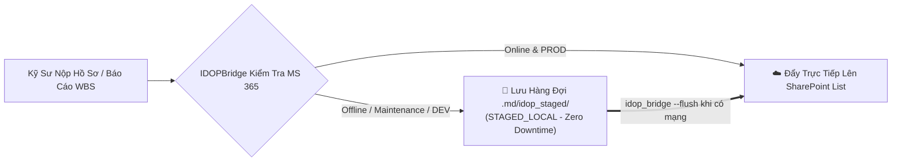

# ADR 0043: Decoupled Resilience, Schema Contract Drift Gate, and Dual-Mode Authentication for IDOP-CCBA-WAY Active Development

## Context
Spoke `IDOP-CCBA-WAY` is currently undergoing active engineering and live deployment onto the Microsoft 365 enterprise ecosystem (58 SharePoint Lists, 5TB Master OneDrive, and Power Automate flows). During this active transition phase:
1. SharePoint schemas in `datamodel/sharepoint/lists/` are expanding and evolving.
2. Network connectivity, tenant maintenance, or sandbox testing must not block engineers working on active construction project deliverables (`2026-04 DH Viet Nhat`).
3. New engineers and automated CI runners need to execute workflows without requiring immediate access to sensitive production certificates (`idop_deploy.pfx`).

## Decision
We formally establish three decoupled architecture mechanisms for integrating `IDOP-CCBA-WAY` during active development:

### 1. Local Staging Queue & Idempotent Replay
When `IDOPBridge` fails to reach Microsoft Graph API (due to maintenance, network outage, or DEV mode):
- Payload is serialized as a standardized JSON AST and stored locally under [`.md/idop_staged/`](../../.md/) with state `STAGED_LOCAL`.
- Engineers receive immediate confirmation: `✅ Local stage saved. Will sync to SharePoint upon reconnection`.
- When connectivity is restored, `idop_bridge --flush` performs an **Idempotent Replay**, syncing records to SharePoint without duplicating entries.

### 2. CI Schema Contract Drift Gate
Hub CI enforces automated schema compatibility validation (`test_idop_schema_compatibility.py`):
- **Open for Extension**: The IDOP development team is free to add new fields, columns, and list definitions in `datamodel/sharepoint/lists/`.
- **Closed for Core Breakage**: Any deletion or renaming of core integration fields (`ProjectCode`, `NationalProjectID`, `ContractId`, `JobAssignments`, `CdeDocuments`) triggers a hard CI failure to prevent silent integration breakage.

### 3. Zero-Config Dual-Mode Authentication Fallback
`IDOPBridge` operates in dual-mode based on environment variables and certificate availability:
- **`IDOP_ENV="DEV"` (Default)**: Automatically runs in **Local Mock Sandbox**. New engineers can clone and test workflows immediately with zero credentials required.
- **`IDOP_ENV="PROD"`**: Requires valid App-Only Certificate (`idop_deploy.pfx`) and password (`IDOP_CERT_PASSWORD`) to authenticate against `https://ccba.sharepoint.com/sites/idop`.

## Consequences
- **Positive**: 100% Zero-Downtime for project engineers regardless of SharePoint maintenance status.
- **Positive**: Instant, friction-free onboarding for developers and CI runners without exposing production secrets.
- **Positive**: Guarantees architectural alignment between Hub, Spoke, and IDOP during rapid iteration.
