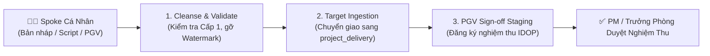

# ADR 0046: Personal Sandbox Spoke Lifecycle, Registry TTL, and CCBA Charter 2026 Alignment

## Context
As the CCBA Agent Platform scales across all technical personnel, individual engineers, researchers, and project managers require dedicated local workspaces to experiment with AI prompts, develop automation scripts, and execute assigned Phiếu Giao Việc (PGV) tasks without endangering official project production repositories. However:
1. Unlimited, unmonitored personal spoke creation risks Registry Bloat and orphaned metadata in Hub's `spoke_registry.yaml`.
2. Uncontrolled output generation in personal sandboxes risks accidental distribution of unverified draft reports as certified CCBA deliverables.
3. Organizational roles and functional departments in workspace contexts must strictly mirror the authentic *Quy chế Tổ chức và Hoạt động CCBA 2026* (5 Functional Departments, 11 Accountability Seats, 5-Level QC Gate, and GWC Capacity Framework).

## Decision
We formally establish the **Personal Sandbox Spoke Specification (`specialized_extension` / `personal_sandbox`)**, the **Tiered Registry TTL Protocol**, the **Sandbox Watermarking & QC Level Cap**, and the **3-Step Deliverable Promotion & PGV Handover Pipeline**.

### 1. Personal Sandbox Taxonomy & CCBA Charter 2026 Schema
Personal sandboxes are classified under Archetype `specialized_extension` with `sub_type: "personal_sandbox"`. Their `.md/workspace_context.yaml` strictly maps to CCBA Charter 2026:
- The 5 Functional Departments + Ban Giám đốc (`department`): `PHONG_TONG_HOP`, `PHONG_RD_HTQT`, `PHONG_BIM_THIET_KE`, `PHONG_BIM_DU_AN`, `PHONG_TV_KD_HCM`, `BAN_GIAM_DOC`.
- The 11 Accountability Seats (`seat_role`): `GIAM_DOC`, `PHO_GIAM_DOC`, `CO_VAN_PHAP_LY_QA`, `TRUONG_PHONG_TONG_HOP`, `PHU_TRACH_KE_TOAN`, `TRUONG_PHONG_RD_HTQT`, `IDOP_LEAD`, `TRUONG_PHONG_BIM_THIET_KE`, `TRUONG_PHONG_BIM_DU_AN`, `CHU_TRI_HOP_DONG_PM`, `CHU_TRI_BO_MON`, `KY_SU_THUC_THI`.
- 5-Level QC Authorization (`qc_governance`): `LEVEL_1_TECHNICAL_CHECK` to `LEVEL_5_FINAL_APPROVAL` (Điều 13).
- IDOP Task Integration (`idop_tasks`): Maps active `pgv_code` items with max 70% advance limit (`max_advance_rate: 0.70` per Điều 17).

### 2. Tiered Registry Registration & 60-Day TTL Sweep
- Hub's `spoke_registry.yaml` flags sandboxes with `is_sandbox: true` and `owner_email`.
- Central batch syncs (`sync_spoke.py --all`) automatically exclude personal sandboxes unless explicitly targeted (`--include-sandboxes`).
- Sandboxes inactive for > 60 days are marked `INACTIVE_SANDBOX` and safely swept during registry maintenance.

### 3. Sandbox Watermarking & QC Level Cap
- All documents, calculations, and audit reports generated inside a sandbox automatically include the mandatory header/footer:
  `[CCBA SANDBOX DRAFT — BẢN THẢO NGHIÊN CỨU NỘI BỘ — CHƯA PHÁT HÀNH CHÍNH THỨC]`.
- Sandbox operations are capped at **QC Level 1 (Technical Check)**. Direct publishing to official SharePoint `CdeDocuments` is strictly blocked by `IDOPBridge` when `sandbox_mode: true`.

### 4. 3-Step Deliverable Promotion & PGV Handover Pipeline

1. **Cleanse & Validate**: Kỹ sư chạy kiểm tra Cấp 1, hệ thống tự động gỡ thủy ấn `[CCBA SANDBOX DRAFT]` khi đạt chuẩn.
2. **Target Ingestion**: Dữ liệu đóng gói được chuyển thẳng sang Spoke Dự Án đích (`delivery_project`) hoặc đẩy lên Hub qua `/ccba-propose-to-hub`.
3. **PGV Sign-off Staging**: `IDOPBridge` tự động đánh dấu thông tin phiếu giao việc (`JobAssignments`) để chuẩn bị PM duyệt năng suất Tầng 3.

## Consequences
- **Positive**: Tự do sáng tạo và thử nghiệm an toàn thiết thực cho thành viên CCBA.
- **Positive**: Tuân thủ 100% Quy chế CCBA 2026, triệt tiêu rủi ro sai lệch dữ liệu với Viện IBST.
- **Positive**: Phân định rành mạch giữa tài sản dự án chính thức và bản nháp thử nghiệm cá nhân.
