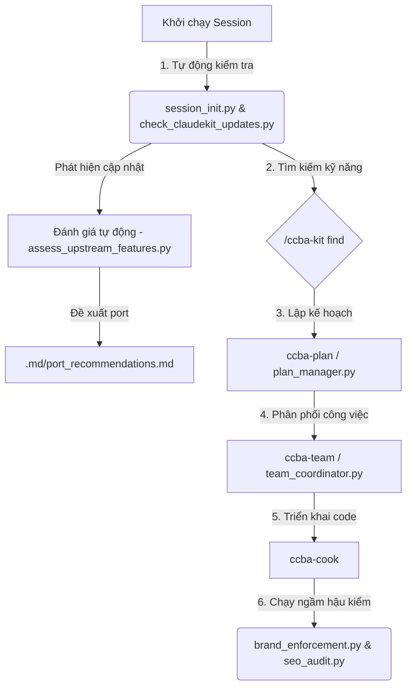

# ClaudeKit Agent Tools Guide

Hướng dẫn Onboarding nhanh dành cho nhà phát triển mới tiếp cận hệ thống công cụ ClaudeKit được tích hợp trong `ccba-agent-platform`.

Hệ thống này cung cấp bộ khung điều phối Agent, kiểm soát chất lượng mã nguồn (Hook), và quản lý kế hoạch triển khai tự động.

---

## 🗺️ Quy trình làm việc tổng quan (Workflow)



---

## 🛠️ Chi tiết các công cụ & Cách sử dụng

### 1. Hệ thống Hook Lifecycle tự động
Các hook này được kích hoạt tự động theo các sự kiện trong phiên làm việc của Agent, bạn **không cần chạy thủ công**:
*   **`session_init.py`**: Tự động tạo thư mục tri thức `.md/` và cấu hình Git.
*   **`privacy_block.py`**: Chặn Agent đọc nhầm file nhạy cảm chứa API Key như `.env`. (Bypass bằng cách thêm tiền tố `APPROVED:` vào đường dẫn).
*   **`naming_convention.py`**: Kiểm tra Agent đặt tên file có đúng chuẩn viết thường/viết hoa không.
*   **`brand_enforcement.py`**: Chạy sau mỗi tool để quét và cảnh báo nếu Agent viết sai tên thương hiệu (như `gemini` thay vì `Gemini`).

---

### 2. Quản lý Kế hoạch (`plan_manager.py` / `/ccba-plan`)
Dùng để thiết kế kế hoạch triển khai tính năng phức tạp một cách trực quan:
*   **Tạo plan mới**:
    ```bash
    python scripts/plan_manager.py create --title "Tính năng X" --phases "Phase1,Phase2"
    ```
*   **Xem trạng thái kế hoạch**:
    ```bash
    python scripts/plan_manager.py status --plan plans/YYMMDD-tinh-nang-x/plan.md
    ```
*   **Chuyển trạng thái phase**:
    ```bash
    python scripts/plan_manager.py check --plan <path> --phase <id> --status <completed|in-progress>
    ```

---

### 3. Điều phối công việc nhóm (`team_coordinator.py` / `/ccba-team`)
Cho phép nhiều AI Agents hoặc thành viên chia sẻ danh sách công việc chung:
*   **Xem các task**: `python scripts/team_coordinator.py list`
*   **Thêm task**: `python scripts/team_coordinator.py add --name "Task X"`
*   **Nhận task**: `python scripts/team_coordinator.py claim --name "Task X" --owner "agent-1"`
*   **Hoàn thành**: `python scripts/team_coordinator.py complete --name "Task X"`

---

### 4. Tìm kiếm & Gọi lệnh ClaudeKit (`find_skills.py` / `/ccba-kit`)
Bộ thư viện 87+ kỹ năng động từ ClaudeKit (bao gồm cả Marketing và Engineering):
*   **Tìm kiếm kỹ năng**:
    ```text
    /ccba-kit find <từ khóa>
    ```
    *Ví dụ*: `/ccba-kit find auth` (Tìm các kỹ năng liên quan đến xác thực đăng nhập).
*   **Chạy lệnh**:
    ```text
    /ccba-kit <tên-kỹ-năng>
    ```
    *Ví dụ*: `/ccba-kit email` hoặc `/ccba-kit seo` (Nạp nóng hướng dẫn chuyên sâu để xử lý tác vụ tương ứng).

---

### 5. Công cụ SEO Audit (`seo_audit.py`)
Phân tích nhanh chất lượng SEO kỹ thuật của bất kỳ file Markdown hay HTML nào:
*   **Cách chạy**:
    ```bash
    python scripts/seo_audit.py path/to/document.md
    ```
*   **Nội dung kiểm tra**: Phân cấp tiêu đề (H1-H6), độ dài meta tags, thẻ alt hình ảnh, số lượng từ ngữ, và chấm điểm chất lượng SEO theo thang điểm 100.

---

### 6. Đánh giá tính năng mới (`assess_upstream_features.py`)
Tự động so sánh sự thay đổi ở cả hai kho chứa thượng nguồn `claudekit-engineer` và `claudekit-marketing`, sau đó gọi LLM để đánh giá sự phù hợp trước khi port:
*   **Cách chạy thủ công (Kiểm thử giả lập)**:
    ```bash
    python scripts/assess_upstream_features.py --test-mock
    ```
*   **Cách chạy thực tế (So sánh Git SHA)**:
    ```bash
    python scripts/assess_upstream_features.py --repo-path <đường_dẫn_repo> --repo-type <engineer|marketing> --base <SHA_cũ> --head <SHA_mới>
    ```
*   **Đầu ra**: Báo cáo chấm điểm và đề xuất port sẽ được xuất tại `.md/port_recommendations.md`.
