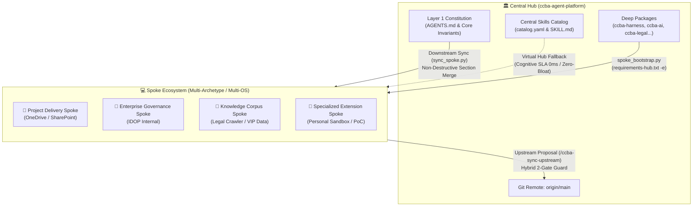
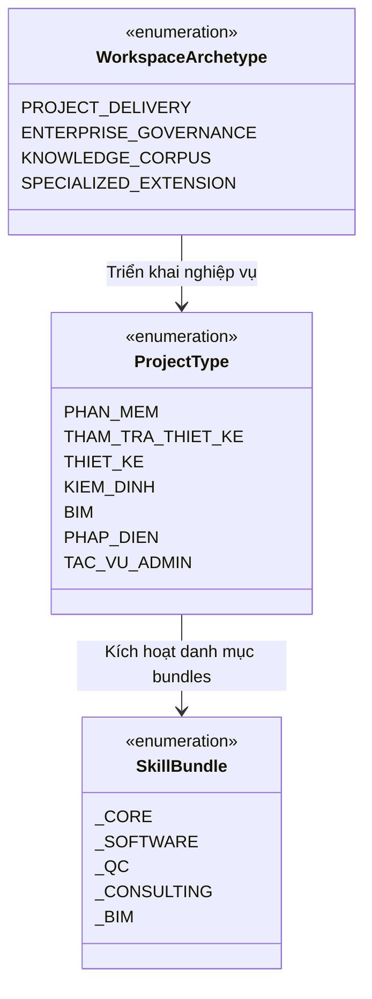
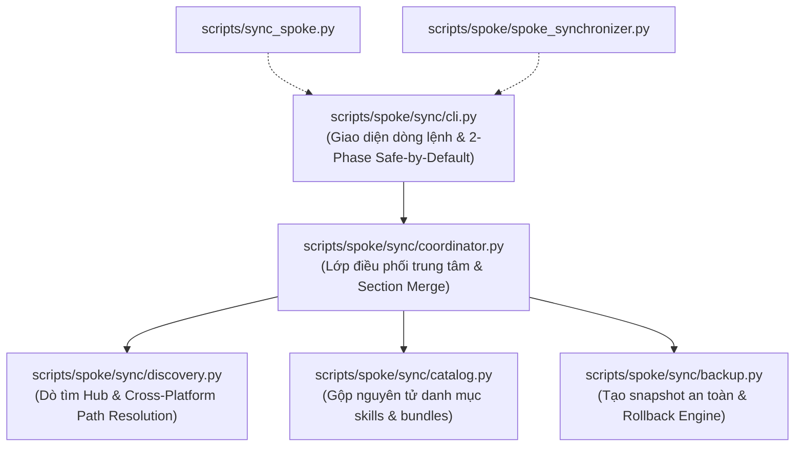
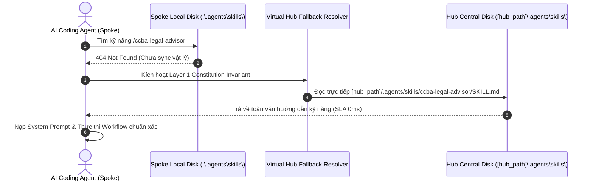
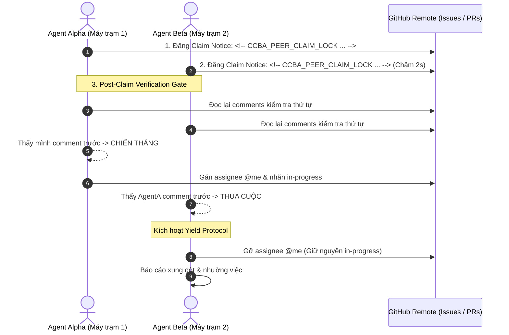

# Kiến Trúc Đồng Bộ Hub-Spoke & Khung Quản Trị Đa Máy Trạm (Multi-Device Platform Governance)

> **Mã tài liệu:** `CCBA-GOV-SYNC-2026`  
> **Phiên bản:** Rev 1.0 (2026)  
> **Căn cứ kiến trúc & pháp chuẩn:** [ADR 0009](../adr/0009-hub-spoke-sync-and-partition-strategy.md), [ADR 0036](../adr/0036-brownfield-spoke-adoption-and-non-destructive-onboarding.md), [ADR 0041](../adr/0041-hub-spoke-ecosystem-taxonomy-and-archetypes.md), [ADR 0042](../adr/0042-tiered-ai-pre-submission-gate-and-tri-repo-sync.md), [ADR 0044](../adr/0044-spoke-hub-package-bootstrap-standard.md), [ADR 0045](../adr/0045-hub-proposal-ingestion-governance.md), [ADR 0051](../adr/0051-hub-spoke-sync-hardening-constitution-preservation-and-virtual-fallback.md), [Session Learnings Rule 1.8](../../.md/knowledge/session_learnings.md), [Guardrails 12 & 13](../rules/execution_guardrails.md).

---

## 1. Tổng Quan & Triết Lý Phân Tán (Hub-and-Spoke Topology)

Hệ sinh thái CCBA Agent Services Platform được thiết kế nhằm phục vụ đồng thời hai mục tiêu dường như mâu thuẫn:
1. **Quản trị Chuẩn Mực Trung Tâm (Centralized Governance):** Duy trì sự nghiêm ngặt tuyệt đối về Hiến pháp AI Agent, tiêu chuẩn chất lượng mã nguồn, quy chuẩn pháp lý xây dựng Việt Nam và kho kỹ năng (Skills Catalog) dùng chung tại **Hub Repository** (`ccba-agent-platform`).
2. **Tự Do Sản Xuất & Bảo Mật Ngoại Vi (Decentralized Autonomy & Privacy):** Cho phép các dự án tư vấn, thẩm tra, kiểm định và nghiên cứu tại **Spoke Workspaces** vận hành độc lập, bảo vệ dữ liệu nhạy cảm của khách hàng, lưu trữ các file đồ họa dung lượng lớn (Revit `.rvt`, AutoCAD `.dwg`, scan PDF) mà không làm ô nhiễm kho mã nguồn trung tâm.



### Các Luồng Trao Đổi Tri Thức Hai Chiều:
- **Downstream Sync (Hub $\rightarrow$ Spoke):** Phân phối có chọn lọc các bundles kỹ năng, chuẩn hóa quy tắc bảo vệ và cập nhật Hiến pháp nền tảng.
- **Virtual Hub Fallback (Hub $\cdots$ Spoke):** Cho phép Agent tại Spoke tra cứu và áp dụng trực tiếp 100% kỹ năng từ Hub mà không cần tải trùng lặp hàng trăm megabytes về ổ đĩa cục bộ.
- **Upstream Contribution (Spoke $\rightarrow$ Hub):** Chuyển giao các sáng kiến, công cụ, bản sửa lỗi từ thực tế sản xuất ngược về Hub thông qua cơ chế đề bạt đề xuất (Proposals) và kiểm định rò rỉ nghiêm ngặt.

---

## 2. Phân Loại Không Gian Làm Việc: Archetypes vs Project Types (ADR-0041)

Để quản trị chính xác phạm vi công cụ và mức độ bảo mật, nền tảng phân biệt rạch ròi giữa **Mô Thức Không Gian Làm Việc (Workspace Archetype)** và **Bộ Môn Nghiệp Vụ (Project Type)**:



### 2.1. 4 Mô Thức Archetypes Chuẩn

| Archetype | Bản chất lưu trữ | Mục đích sử dụng | Chính sách Git Remote | Bundles mặc định |
| :--- | :--- | :--- | :--- | :--- |
| `project_delivery` | OneDrive / SharePoint | Dự án tư vấn thiết kế, thẩm tra, kiểm định thực tế cho khách hàng. | **Tuyệt đối cấm** public Git remote; chỉ lưu trữ đám mây nội bộ. | `_core`, `_qc`, `_consulting` |
| `enterprise_governance` | Server / Kho mã nội bộ | Hệ điều hành quản trị nội bộ IDOP, đồng bộ 58 SharePoint lists. | Private Git nội bộ có kiểm soát truy cập nghiêm ngặt. | `_core`, `_consulting` |
| `knowledge_corpus` | Local SSD / Data Lake | Kho pháp điển hóa, crawler văn bản pháp luật, vector database RAG. | Git repo chuyên biệt (e.g. `ccba-legal-knowledge`). | `_core`, `_software`, `_consulting` |
| `specialized_extension` | Local Workspace / Sandbox | Nghiên cứu công nghệ mới, plugin CAD/BIM, ươm tạo sáng kiến cá nhân (`sub_type: personal_sandbox`). | Git feature branch hoặc standalone sandbox. | `_core`, `_software` (hoặc tùy biến) |

### 2.2. Ánh Xạ Project Types Sang Bundles
Khi khởi tạo qua lệnh `init-spoke`, người dùng chỉ định `--type <Project Type>`. Trình biên dịch `catalog.yaml` tự động nạp các bundles tương ứng:
- **Phần mềm:** `_core`, `_software`
- **Thẩm tra thiết kế / Thiết kế / Kiểm định:** `_core`, `_qc`, `_consulting`
- **BIM:** `_core`, `_bim`
- **Pháp điển:** `_core`, `_software`, `_consulting`
- **Tác vụ Admin:** `_core`, `_consulting`

Nếu một Spoke cần bổ sung công cụ ngoài bundle mặc định, Spoke chỉ cần khai báo thêm trường `additional_bundles` trong `.md/workspace_context.yaml` (ví dụ: `additional_bundles: [_consulting]`).

---

## 3. Động Cơ Đồng Bộ Xuôi & Bảo Tồn Hiến Pháp (Non-Destructive Section Merge — ADR-0051)

Động cơ đồng bộ Spoke được kiến trúc thành package chuyên trách tại `scripts/spoke/sync/`, bao gồm 5 module phân tầng:



### 3.1. Thuật Toán Hòa Trộn Hiến Pháp Phân Tầng (Section Merge Algorithm)
Khi cập nhật tệp `AGENTS.md` trên Spoke, `SpokeSynchronizer` thực hiện hòa trộn không phá hủy (Non-Destructive Section Merge) để bảo vệ toàn vẹn các cấu hình bản địa:

1. **Phân rã theo cấp mục `## Heading`:** Tệp `AGENTS.md` của cả Hub và Spoke được chia thành các khối độc lập dựa trên tiêu đề cấp 2.
2. **Cập nhật Layer 1 Constitution:** Phần mở đầu (Preamble) và các mục chuẩn mực chung từ Hub được đồng bộ đè lên bản cũ của Spoke.
3. **Bảo tồn mục riêng của Spoke:** Toàn bộ các section mang tính đặc thù dự án của Spoke (như `## Agent skills`, `## Issue Tracker`, `## Domain Docs`, `## Custom Rules`) được bảo lưu 100% và gộp ở phần thân tài liệu.

### 3.2. Thuật Toán Universal Invariant Multiline Regex (Rule 1.8)
Để hòa trộn mục `## Core Invariants`, hệ thống sử dụng biểu thức chính quy nhận diện cấu trúc bullet đa dòng:

```python
INVARIANT_BULLET_PATTERN = re.compile(
    r"^[ \t]*(?:[-*]|\d+\.)[ \t]+\*\*([^*:]+)(?::\*\*|\*\*:)[\t ]*(.*)"
)
```

- **Cơ chế thu nạp đa dòng (Multiline-Aware):** Mọi dòng văn bản giải thích, khối mã nguồn `bash` và danh sách con nằm thụt dòng bên dưới một bullet in đậm sẽ được gom nguyên vẹn vào bullet đó.
- **Ranh giới gộp và khuyến nghị kiến trúc:**
  - Nếu Spoke định nghĩa bullet in đậm mới không trùng khóa với Hub: Hệ thống bảo tồn và bổ sung vào danh sách Invariants.
  - Nếu Spoke sửa đổi nội dung một bullet có cùng khóa với Hub (ví dụ: `**Hub vs Spoke**:`): Bản sửa của Spoke sẽ bị ghi đè bởi bản Hub (Hub Invariant Clobbering).
  - *Khuyến nghị:* Mọi quy tắc và bất biến riêng của dự án Spoke **bắt buộc** nên được đặt trong một heading cấp 2 độc lập (ví dụ: `## Project Custom Invariants` hoặc `## Spoke Invariants`) để tránh bị can thiệp bởi bộ phân tích bullet của Hub.

### 3.3. Đồng Bộ Đối Xứng 1:1 Giữa Workflow & Skill Bundle
Để chấm dứt hoàn toàn hiện tượng **Ghost Workflows** (Workflow trỏ tới Skill không tồn tại do khác bundle):
- Mọi tệp workflow (`.agents/workflows/*.md`) bắt buộc khai báo trường `bundle:` trong frontmatter khớp tuyệt đối với Skill liên kết (`.agents/skills/**/SKILL.md`).
- Trình kiểm tra `python scripts/governance/compile_catalog.py --check` tự động thẩm tra sự đối xứng này trong CI pipeline.

---

## 4. Cơ Chế Virtual Hub Fallback & SLA Zero-Bloat (ADR-0051)

Một trong những cải tiến kiến trúc mang tính đột phá của CCBA Platform là **Virtual Hub Fallback**, cho phép Spoke duy trì trạng thái Zero-Bloat (không nhân bản hàng trăm megabytes thư viện) mà vẫn có khả năng vận hành toàn diện.



### Phân Định Giữa Hai Tầng Nhận Thức & Thực Thi:

1. **Tầng Nhận Thức (Cognitive Instruction Layer):**
   - Agent tại Spoke sử dụng công cụ đọc file (`view_file`) để đọc hướng dẫn tác nghiệp từ Hub.
   - Hoàn toàn không tốn dung lượng đĩa của Spoke, thời gian kích hoạt tức thì (0ms).
   - Được bảo đảm bởi Điều khoản Bất biến Hiến pháp trong `AGENTS.md`.
2. **Tầng Thực Thi Thời Gian Chạy (Execution Runtime Layer):**
   - Nếu kỹ năng yêu cầu thực thi các thư viện Python chuyên biệt của Hub (`ccba_legal`, `ccba_ooxml`, `mdconverter`), môi trường ảo `.venv` của Spoke **bắt buộc** phải cài đặt các gói này ở chế độ editable link (`pip install -e`).
   - Khai báo danh mục gói trong `hub_packages` của `.md/workspace_context.yaml` và chạy `python scripts/spoke/spoke_bootstrap.py`.
3. **IDE Slash Command Autocomplete:**
   - Các công cụ IDE (Cursor, Claude Code, Windsurf) chỉ lập chỉ mục cho các tệp tồn tại thực tế trên đĩa Spoke. Nếu người dùng muốn xuất hiện lệnh slash command trong menu gợi ý của IDE, cần thực hiện đồng bộ vật lý theo nhu cầu:
     ```bash
     python [hub_path]/scripts/sync_spoke.py --spoke . --sync-item <skill_name> --apply
     ```

---

## 5. Quản Trị Đa Máy Trạm & Cô Lập Trạng Thái Máy (Rule 1.8 & Issue #326)

Khi một dự án Spoke được làm việc bởi một kỹ sư trên nhiều thiết bị khác nhau (PC văn phòng chạy Windows, Laptop cá nhân chạy Linux/WSL, hoặc Cloud Runner):

### 5.1. Bất Biến Cô Lập Trạng Thái Máy (Machine-State Decoupling Invariant)
- **Tuyệt đối cấm commit đường dẫn tuyệt đối:** Không bao giờ ghi cứng các đường dẫn mang tính cục bộ máy trạm (`D:\GitHubProjects\...`, `C:\Users\...`, `/home/vvc/...`) vào `workspace_context.yaml` hay các tệp được Git theo dõi.
- **Biến môi trường ưu tiên cao nhất `CCBA_HUB_PATH`:** Vị trí của kho lưu trữ Hub trên từng máy trạm được khai báo thông qua biến môi trường hệ thống. Động cơ phân giải của CCBA sẽ luôn ưu tiên biến này trước khi đọc cấu hình tĩnh.

### 5.2. Cơ Chế Cross-Drive Fallback
Trên hệ điều hành Windows, khi Hub và Spoke nằm trên hai ổ đĩa logic khác nhau (ví dụ: Hub nằm ở `C:\Workspace\ccba-agent-platform`, còn Spoke nằm trên thư mục OneDrive tại `D:\OneDrive - IBST BIM\...`), hàm chuẩn `os.path.relpath()` sẽ ném ngoại lệ `ValueError`.

Hệ thống xử lý an toàn bằng thuật toán Fallback:
```python
try:
    rel_hub = os.path.relpath(hub_path.resolve(), spoke_root.resolve())
    rel_hub_str = Path(rel_hub).as_posix()
except ValueError:
    # Cross-drive on Windows (e.g. C:\ vs D:\)
    rel_hub_str = None
```
Khi phát hiện khác ổ đĩa, giá trị `hub_path` trong `workspace_context.yaml` sẽ được đặt là `null`/`None`, buộc Agent và các script phải phân giải động thông qua `CCBA_HUB_PATH`, triệt tiêu hoàn toàn nguy cơ rò rỉ đường dẫn ổ đĩa tuyệt đối khi đẩy code lên Git remote.

### 5.3. Chuẩn Hóa Regex Quét Đường Dẫn Tuyệt Đối (Scanner Robustness)
Các bộ kiểm tra vệ sinh Spoke (`check_spoke_cleanliness.py` và `check_spoke_leakage.py`) áp dụng mẫu biểu thức chính quy nâng cao để nhận diện cả tiền tố raw string và đường dẫn ổ đĩa Windows không có dấu gạch chéo kết thúc:
```regex
(?:[rR]?["']|[=:]\s*)[A-Za-z]:[\\/]+[A-Za-z0-9_.-]+
```
Mọi đường dẫn fallback mặc định hợp lệ trên Windows bắt buộc phải được đánh dấu bằng chú thích đặc biệt:
```python
DEFAULT_WIN_HUB = r"D:\GitHubProjects\ccba-agent-platform"  # ccba:allow-machine-path
```

---

## 6. Giao Thức Khóa Nhận Việc An Toàn & Lũy Kế Đột Biến (Guardrails #12 & #13)

Trong môi trường làm việc cộng tác đa máy trạm và đa tác tử (Multi-Client / Peer Agents), nguy cơ xung đột (Race Condition) và trùng lặp tài nguyên từ xa là rất cao.



### 6.1. Giao Thức Khóa Issue (Issue Claim Lock Protocol — TTL 24h)
Khi một tác tử nhận xử lý một Issue từ Backlog:
1. **Sanitize Slug:** Tạo branch name an toàn chống Shell Injection: `feat/issue-<id>-<slug>`.
2. **Đăng Claim Notice máy-đọc-được:** Tạo tệp tạm tại `.md/scratch/claim_notice_<id>.md` và đẩy lên qua cờ an toàn `-F`:
   ```markdown
   <!-- CCBA_PEER_CLAIM_LOCK
   host: linux-workstation
   branch: feat/issue-123-optimize-sync
   claimed_at: 2026-09-25T06:30:00Z
   ttl_hours: 24
   -->
   🤖 **Agent Claim & Coordination Notice**: Issue này đang được xử lý trong phiên làm việc hiện tại. Vui lòng bỏ qua, không claim nhận việc trùng lặp.
   ```
3. **Cơ chế Nhượng Bộ (Yield Protocol):** Kiểm tra lại lịch sử bình luận. Nếu phát hiện tác tử khác đã claim trước, tác tử hiện tại bắt buộc phải nhượng bộ, gỡ assignee của mình và tuyệt đối không gỡ nhãn `in-progress` của tác tử thắng cuộc.

### 6.2. Giao Thức Khóa Pull Request & Pre-Push Lease Invariant (TTL 4h)
- Khi xử lý một Pull Request, tác tử thiết lập khóa `<!-- CCBA_PR_CLAIM_LOCK ... -->` với TTL 4 giờ.
- **Pre-Push Lease Invariant:** Tuyệt đối cấm sử dụng lệnh ép buộc trần `git push -f`. Mọi thao tác push sau khi rebase bắt buộc phải sử dụng:
  ```bash
  git push --force-with-lease
  ```
- Khi hoàn tất, giải phóng khóa bằng bình luận chứa thẻ `<!-- CCBA_PR_CLAIM_RELEASE -->`.

### 6.3. Cổng Kiểm Tra Tính Lũy Kế Đột Biến (Remote Mutation Idempotency Gate)
Khi thực thi các lệnh làm biến đổi trạng thái từ xa (`gh issue create`, `gh pr create`, `git push`):
- Nếu lệnh bị gián đoạn, mất mạng, timeout hoặc hủy giữa chừng: Tác tử **bắt buộc** phải truy vấn trạng thái remote (`gh issue list`, `gh pr list`, `git ls-remote`) trước khi chạy lại lệnh.
- Nghiêm cấm chạy lại lệnh một cách mù quáng nhằm ngăn chặn việc phát sinh hàng loạt issues hoặc PR trùng lặp rác trên GitHub.

---

## 7. Bảng Ma Trận Bất Biến & Quy Tắc Tuân Thủ (Compliance Matrix)

| Mã Bất Biến | Tên Quy Tắc | Phạm Vi Áp Dụng | Cơ Chế Cưỡng Chế | Căn Cứ Pháp Chuẩn |
| :--- | :--- | :--- | :--- | :--- |
| **INV-SYNC-01** | Non-Destructive Section Merge | Toàn bộ Spokes | `merge_agents_constitution()` | ADR-0051 |
| **INV-SYNC-02** | Universal Invariant Multiline | Toàn bộ Spokes | `coordinator.py` Multiline Regex | Rule 1.8, Issue #326 |
| **INV-SYNC-03** | 1:1 Bundle Pairing | Hub & Spokes | `compile_catalog.py --check` trong CI | ADR-0051 |
| **INV-SYNC-04** | Virtual Hub Fallback | Toàn bộ Spokes | Layer 1 Constitution `AGENTS.md` | ADR-0051 |
| **INV-SYNC-05** | Machine-State Decoupling | Môi trường Đa Máy | `CCBA_HUB_PATH` & Cross-Drive Fallback | Rule 1.8, Issue #326 |
| **INV-SYNC-06** | Machine Path Scanner Guard | Hub & Spokes | `check_spoke_leakage.py --all` | ADR-0045, Issue #326 |
| **INV-SYNC-07** | Multi-Client Peer Claim Lock | Hub Backlog & PRs | Thẻ Claim Lock & TTL Protocol | Guardrails 12 & 13 |
| **INV-SYNC-08** | Pre-Push Lease Invariant | Hub & Git Spokes | Bắt buộc `--force-with-lease` | Guardrail 13.B |
| **INV-SYNC-09** | Remote Mutation Idempotency | Toàn bộ Tác tử | State Inspection Gate trước khi retry | Hiến pháp Layer 1 |
| **INV-SYNC-10** | Safe-by-Default 2-Phase Sync | Động cơ Sync CLI | Mặc định non-interactive preview; yêu cầu `--apply` | ADR-0051 |

---

*Tài liệu được chuẩn hóa và quản trị bởi CCBA Core Architecture Team.*
