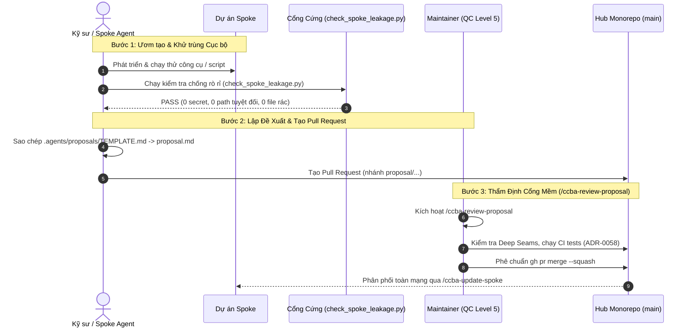

# Hướng Dẫn Quy Trình Đề Bạt Sáng Kiến Từ Spoke Lên Hub Monorepo

**Tài liệu chuẩn hóa:** `SOP-CCBA-SPOKE-TO-HUB-INGESTION-2026`  
**Căn cứ kiến trúc & pháp lý:** [ADR-0045](file:///d:/GitHubProjects/ccba-agent-platform/docs/adr/0045-hub-proposal-ingestion-governance.md), [ADR-0046](file:///d:/GitHubProjects/ccba-agent-platform/docs/adr/0046-personal-sandbox-lifecycle-and-charter-2026-alignment.md), [ADR-0058](file:///d:/GitHubProjects/ccba-agent-platform/docs/adr/0058-live-collaboration-artifacts-workspace-mirroring-and-charter-alignment.md), Quy chế CCBA Charter 2026.

---

## 1. Triết Lý Khuyếch Tán Tri Thức Hai Chiều (Bidirectional Diffusion)

Trong mô hình mạng lưới Hub-and-Spoke của CCBA Agent Platform:
- **Hub $\rightarrow$ Spoke:** Hub phân phối nền tảng chuẩn mực, các Deep Packages (`ccba-ai`, `ccba-harness`, `ccba-maskara`, `ccba-legal`), các quy tắc Hiến pháp và danh mục kỹ năng dùng chung.
- **Spoke $\rightarrow$ Hub:** Các dự án thực tế tại Spoke là nơi ươm tạo, giải quyết các bài toán kỹ thuật mới (bản vẽ CAD/BIM, phân tích thoát nạn, kiểm tra QCVN). Khi một công cụ/kỹ năng được kiểm chứng hữu ích và có tần suất sử dụng cao, nó cần được đề bạt lên Hub để trở thành tài sản chung của toàn bộ tổ chức.

---

## 2. Quy Trình Chuyển Giao Sáng Kiến 3 Bước



---

## 3. Chi Tiết Các Chốt Chặn Quản Trị (Hybrid 2-Gate Standard)

### Chốt Chặn 1: Cổng Cứng Tự Động (Hard Gate — CI Automation)
Trước khi gửi PR lên Hub, tác giả bắt buộc phải chạy lệnh kiểm tra rò rỉ:
```bash
python scripts/governance/check_spoke_leakage.py
```
Cổng cứng tự động chặn đứng nếu vi phạm một trong các điều kiện:
- Chứa các thư mục rác / tạm của Spoke: `.md/teach/`, `.tmp/`, `.out-of-scope/`, `__pycache__/`.
- Chứa đường dẫn ổ đĩa tuyệt đối dạng Windows (`D:\...`, `C:\Users\...`).
- Tệp đề xuất trong `.agents/proposals/` thiếu frontmatter metadata bắt buộc (`proposal_id`, `type`, `status`, `name`).

### Chốt Chặn 2: Cổng Mềm Tương Tác (Soft Gate — Supervised Review)
Maintainer tại Hub thực thi nghi thức thẩm định chuẩn hóa 5 bước qua `/ccba-review-proposal`:
1. **Tiếp nhận & Khảo sát:** Đọc tệp proposal và phân tích diff mã nguồn.
2. **Kiểm tra Rò rỉ Spoke:** Đối soát bằng `check_spoke_leakage.py`.
3. **Thẩm định Kiến trúc Deep Seams:** Đảm bảo mã nguồn mới nằm trong `packages/<pkg>/` với giao diện export công khai tại `__init__.py`.
4. **Kiểm tra Khóa Tất Định (ADR-0058):** Chạy `python -m ccba_harness verify-patch --preset ci` đạt Exit Code = 0.
5. **Ký duyệt Cấp 5:** Chỉ Maintainer có thẩm quyền QC Level 5 (theo Điều 13 Quy chế CCBA 2026) mới được ký phê chuẩn merge vào nhánh `main`.

---

## 4. Nguyên Tắc Bất Biến Về Bảo Tồn Kỹ Năng Nghiệp Vụ Chu Kỳ Dài

> [!CAUTION]
> **Quy định Cấm Tuyệt Đối Thuật Toán Tự Ý Khai Tử Kỹ Năng (Zero-Usage Auto-Deprecation Ban):**
> 
> Một số nghiệp vụ tư vấn xây dựng có chu kỳ rất dài (ví dụ: hồ sơ hoàn thành công trình, quyết toán dự án, nghiệm thu PCCC chỉ diễn ra 6–12 tháng một lần). Trong khoảng thời gian giữa các chu kỳ, chỉ số triệu hồi (invocations) trên Telemetry có thể bằng 0.
> 
> Do đó, **nghiêm cấm mọi cơ chế phần mềm hoặc thuật toán tự động xóa bỏ, ẩn hoặc gắn nhãn deprecate cho kỹ năng** chỉ dựa trên số liệu thống kê ngắn hạn. Việc điều chỉnh danh mục kỹ năng bắt buộc phải có quyết định bằng văn bản của Hội Đồng Kỹ Thuật (Hiến pháp 11 Ghế CCBA Charter 2026).
