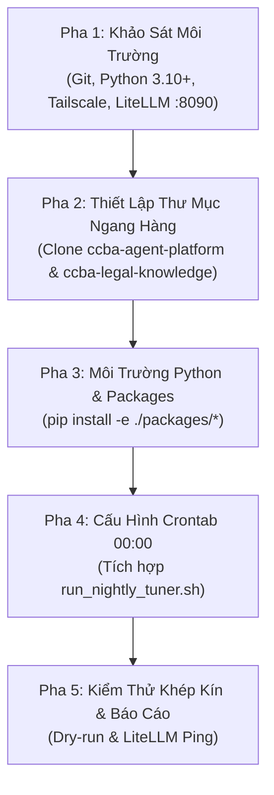

# 🤖 CHỈ DẪN DÀNH CHO ANTIGRAVITY AGENT TRÊN SERVER SPARK (`100.83.192.30`)

> **Mục tiêu:** Cung cấp quy trình tự động hóa (Autonomous Playbook) để Antigravity Agent khi được kích hoạt trên **Server Spark** có thể tự khảo sát, cài đặt, cấu hình và vận hành toàn bộ nền tảng CCBA Hub & Knowledge Spoke mà không cần con người can thiệp.

---

## 🎯 VAI TRÒ CỦA AGENT TRÊN SERVER SPARK

Trên Server Spark (`100.83.192.30`), Agent đóng vai trò là **Kỹ Sư Trưởng Hạ Tầng AI (AI Platform Site Reliability Engineer)**:
1. Duy trì hoạt động 24/7 của AI Gateway LiteLLM (`:8090`).
2. Quản lý kho tri thức gốc `ccba-legal-knowledge` (OKF v2.0).
3. Đảm bảo cỗ máy **Nightly Auto-Tuner Daemon** tự động quét 73+ kỹ năng và mở PR hàng đêm lúc 00:00.

---

## 📋 QUY TRÌNH TRIỂN KHAI TỰ ĐỘNG 5 PHA (5-PHASE RUNBOOK)

Khi người dùng yêu cầu: *"Triển khai hoặc kiểm tra hệ thống CCBA trên Server"*, Agent **PHẢI** thực hiện tuần tự 5 pha sau:



---

### 🔍 PHA 1: KHẢO SÁT MÔI TRƯỜNG (RECONNAISSANCE)

Agent thực thi các lệnh sau để kiểm tra điều kiện tiên quyết:

```bash
# 1. Kiểm tra Python version (Yêu cầu >= 3.10)
python3 --version

# 2. Kiểm tra Git & GitHub CLI
git --version
gh --version || echo "GitHub CLI not found, fallback to SSH"

# 3. Kiểm tra LiteLLM Gateway trên port :8090
curl -s http://localhost:8090/health || echo "LiteLLM Offline"

# 4. Kiểm tra Tailscale IP
tailscale ip -4 || ip a
```

---

### 📂 PHA 2: THIẾT LẬP THƯ MỤC & REPOSITORIES (TOPOLOGY)

Agent duy trì cấu trúc **Thư mục Ngang Hàng (Sibling Directory)** tại `~/ccba` hoặc `/opt/ccba`:

```bash
BASE_DIR="$HOME/ccba"
mkdir -p "$BASE_DIR" && cd "$BASE_DIR"

# 1. Clone / Pull Hub (ccba-agent-platform)
if [ -d "$BASE_DIR/ccba-agent-platform/.git" ]; then
    cd "$BASE_DIR/ccba-agent-platform" && git pull origin main
else
    git clone https://github.com/vvChu/ccba-agent-platform.git "$BASE_DIR/ccba-agent-platform"
fi

# 2. Clone / Pull Knowledge Spoke (ccba-legal-knowledge)
if [ -d "$BASE_DIR/ccba-legal-knowledge/.git" ]; then
    cd "$BASE_DIR/ccba-legal-knowledge" && git pull origin main
else
    git clone https://github.com/vvChu/ccba-legal-knowledge.git "$BASE_DIR/ccba-legal-knowledge"
fi

# 3. Clone / Pull Enterprise Governance Spoke (IDOP-CCBA-WAY)
if [ -d "$BASE_DIR/IDOP-CCBA-WAY/.git" ]; then
    cd "$BASE_DIR/IDOP-CCBA-WAY" && git pull origin main
else
    git clone https://github.com/vvChu/IDOP-CCBA-WAY.git "$BASE_DIR/IDOP-CCBA-WAY"
fi
```


---

### 🐍 PHA 3: CÀI ĐẶT MÔI TRƯỜNG PYTHON (PACKAGES SETUP)

Agent kích hoạt Virtualenv và cài đặt các package nội bộ dạng Editable (`-e`):

```bash
cd "$BASE_DIR/ccba-agent-platform"
python3 -m venv .venv
source .venv/bin/activate

pip install --upgrade pip setuptools wheel
pip install -e "./packages/ccba-ai"
pip install -e "./packages/ccba-harness"
pip install -e "./packages/ccba-legal-intel"
pip install pytest pytest-timeout
```

---

### ⏰ PHA 4: CẤU HÌNH LỊCH TRÌNH 24/7 (CRON DAEMON)

Agent đảm bảo quyền thực thi và đăng ký lịch chạy lúc **00:00 hàng ngày**:

```bash
cd "$BASE_DIR/ccba-agent-platform"
chmod +x scripts/cron/run_nightly_tuner.sh
mkdir -p .md/logs

# Đăng ký crontab tự động (không làm trùng lặp)
CRON_ENTRY="0 0 * * * $BASE_DIR/ccba-agent-platform/scripts/cron/run_nightly_tuner.sh >> $BASE_DIR/ccba-agent-platform/.md/logs/nightly_cron.log 2>&1"
(crontab -l 2>/dev/null | grep -Fv "run_nightly_tuner.sh" ; echo "$CRON_ENTRY") | crontab -
```

---

### 🧪 PHA 5: KIỂM THỬ XÁC MINH (VERIFICATION & DRY-RUN)

Agent chạy kiểm thử toàn diện và xuất báo cáo trạng thái:

```bash
# 1. Chạy Dry-Run cho Nightly Auto-Tuner Daemon
python scripts/eval/nightly_tuner_daemon.py --dry-run --max-iter 1

# 2. Chạy Test Suite
python -m pytest scripts/tests/test_nightly_tuner_daemon.py
```

---

### ⚡ PHƯƠNG ÁN 1-CLICK TỰ ĐỘNG (FAST-TRACK)

Thay vì chạy từng lệnh thủ công, Agent hoặc Quản trị viên chỉ cần thực thi kịch bản bootstrap 1 dòng duy nhất:

```bash
bash scripts/deploy/bootstrap_spark_server.sh
```

---

## 🛡️ RÀO CHẮN BẢO MẬT & AN TOÀN TRÊN SERVER (SERVER GUARDRAILS)

1. **Tuyệt đối không clone Spoke Dự Án cá nhân lên Server:** Server chỉ lưu trữ Hub và Kho Luật Gốc (`ccba-legal-knowledge`).
2. **Bảo mật File Bí mật:** Tệp `.env` phải có quyền `chmod 600 .env` (chỉ user server đọc được).
3. **Cơ chế Rollback Tự Động:** Nếu Auto-Tuner làm giảm điểm hoặc gặp lỗi Điểm Liệt, kịch bản phải tự động `git checkout -- .agents/skills/` để bảo vệ nhánh `main`.
