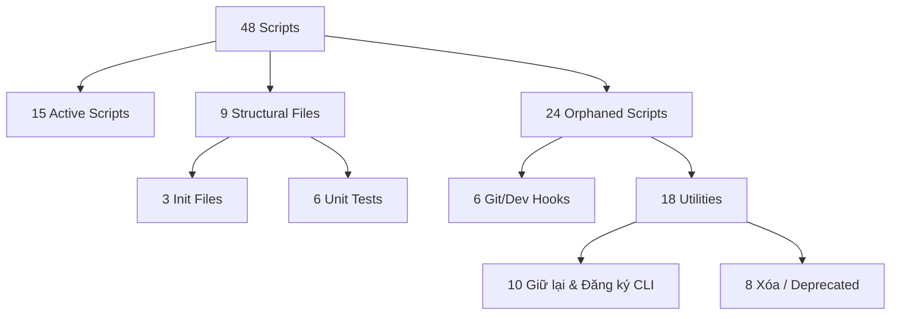

# Báo cáo Kiểm kê & Phân loại Scripts (WF-OS-01)

> **Mã hiệu:** REPORT-2026-003  
> **Trạng thái:** Hoàn thành  
> **Người thực hiện:** Antigravity (AI Agent)  
> **Ngày:** 2026-07-19  

Báo cáo này phân tích chi tiết toàn bộ **48 scripts** được phát hiện trong thư mục `scripts/` của ccba-agent-platform, nhằm xác định những scripts mồ côi (không được hệ thống Agent/Workflow tham chiếu) và đề xuất phương án xử lý (giữ lại, đăng ký CLI, hoặc xóa bỏ).

---

## 1. Bản đồ Tổng hợp Trạng thái

---

## 2. Danh sách phân loại chi tiết

### Nhóm A: Active Scripts (15 files) — GIỮ NGUYÊN
Các script được tham chiếu trực tiếp bởi tệp cấu hình của Skills hoặc Workflows:

| Script | Đường dẫn | Số tham chiếu | Vai trò & Nơi tham chiếu |
| :--- | :--- | :---: | :--- |
| `validate_docs.py` | `scripts/validate_docs.py` | 8 | Kiểm tra định dạng Markdown của tài liệu kỹ thuật ([AGENTS.md](../../.agents/AGENTS.md), `ccba-docs-validator/SKILL.md`) |
| `maskara.py` | `scripts/maskara.py` | 5 | Quét và che giấu API keys/secrets ([ccba-init-spoke](../../.agents/skills/ccba-init-spoke/SKILL.md), `ccba-maskara/SKILL.md`) |
| `sync_spoke.py` | `scripts/sync_spoke.py` | 2 | Đồng bộ dữ liệu Hub và Spoke (`platform-loader/SKILL.md`, `ccba-update-spoke/SKILL.md`) |
| `run_harness_evals.py` | `scripts/run_harness_evals.py` | 2 | Chạy kiểm tra tự động (`ccba-eval-gate/SKILL.md`, `ccba-new-feature/SKILL.md`) |
| `validate_skills.py` | `scripts/validate_skills.py` | 2 | Kiểm tra định dạng tệp tin `SKILL.md` (`ccba-writing-great-skills/SKILL.md`) |
| `audit_pr_comments.py` | `scripts/audit_pr_comments.py` | 2 | Kiểm duyệt comments trên pull request (`ccba-release-feature/SKILL.md`) |
| `check_claudekit_updates.py` | `scripts/spoke/check_claudekit_updates.py` | 1 | Đồng bộ cập nhật từ ClaudeKit (`ccba-sync-upstream/SKILL.md`) |
| `upstream_evaluator.py` | `scripts/spoke/upstream_evaluator.py` | 1 | Engine hợp nhất đồng bộ và đánh AI tính năng thượng nguồn (`ccba-sync-upstream/SKILL.md`) |
| `legal_intelligence.py` | `scripts/legal_intelligence.py` | 1 | Cào và xử lý văn bản pháp luật (`ccba-legal-intel/SKILL.md`) |
| `legal_sync.py` | `scripts/legal_sync.py` | 1 | Đồng bộ văn bản lên NotebookLM (`ccba-update-legal-registry/SKILL.md`) |
| `mock_debugger.py` | `scripts/security/mock_debugger.py` | 1 | Trình giả lập debug lỗi (`ccba-mock-debugger/SKILL.md`) |
| `notebooklm_helper.py` | `scripts/notebooklm_helper.py` | 1 | Helper kết nối RAG NotebookLM (`ccba-notebooklm-connector/SKILL.md`) |
| `privacy_block.py` | `scripts/hooks/privacy_block.py` | 1 | Core filter của Maskara (`ccba-maskara/SKILL.md`) |
| `repomix_pack.py` | `scripts/security/repomix_pack.py` | 1 | Đóng gói codebase cho LLMs (`ccba-docs-manager/SKILL.md`) |
| `session_cleanup.py` | `scripts/session_cleanup.py` | 1 | Dọn dẹp branch/tài liệu sau phiên (`ccba-session-retrospective/SKILL.md`) |
| `split_appendices.py` | `scripts/split_appendices.py` | 1 | Phân tách phụ lục văn bản pháp luật (`ccba-legal-intel/SKILL.md`) |

---

### Nhóm B: Git & Dev Hooks (6 files) — GIỮ NGUYÊN (Thêm docs)
Các file nằm trong `scripts/hooks/`, không được gọi từ Agent nhưng được kích hoạt tự động qua cơ chế pre-commit hoặc CI/CD của kỹ sư:

| Script | Đường dẫn | Trạng thái thực tế | Đề xuất |
| :--- | :--- | :--- | :--- |
| `hook_runner.py` | `scripts/hook_runner.py` | Chạy xích các git hooks | Giữ lại, viết tài liệu hướng dẫn tích hợp vào Git |
| `brand_enforcement.py` | `scripts/hooks/brand_enforcement.py` | Quét quy định logo/branding | Giữ lại làm pre-commit hook |
| `naming_convention.py` | `scripts/hooks/naming_convention.py` | Kiểm tra đặt tên file/folder | Giữ lại làm pre-commit hook |
| `session_init.py` | `scripts/hooks/session_init.py` | Khởi tạo cấu hình phiên làm việc | Giữ lại |
| `simplify_gate.py` | `scripts/hooks/simplify_gate.py` | Kiểm tra độ phức tạp của code (KISS) | Giữ lại |
| `scout_block.py` | `scripts/hooks/scout_block.py` | Ngăn commit các file rác/temp | Giữ lại |

---

### Nhóm C: Utilities & One-off Scripts (18 files) — ĐÁNH GIÁ CHI TIẾT
Đây là các scripts mồ côi thực thụ, được chia làm hai nhóm dựa trên giá trị sử dụng hiện tại:

#### C.1. Nhóm giữ lại & chuyển thành CLI entry points (10 files)
Các tiện ích quan trọng phục vụ phát triển phần mềm hoặc vận hành nền tảng:

| Script | Mục đích | Đề xuất hành động |
| :--- | :--- | :--- |
| `decrypt_spoke_registry.py` | Giải mã registry Spokes (`spoke_registry.yaml`) | Giữ lại. Đăng ký thành entry point `ccba-decrypt-registry` |
| `generate_registry_keys.py` | Sinh cặp khóa RSA cho mã hóa registry | Giữ lại. Đăng ký thành entry point `ccba-gen-keys` |
| `drive_auth_helper.py` | OAuth helper sinh Google Drive API tokens | Giữ lại. Tích hợp chung vào package `ccba-notebooklm` |
| `convert_rules_to_docx.py` | Xuất file quy chế/rules từ MD sang Word | Giữ lại. Tạo entry point `ccba-rules-export` |
| `find_skills.py` | Tìm kiếm nhanh các kỹ năng trong Hub | Giữ lại. Đăng ký thành CLI entry point phục vụ dev |
| `skill_generator.py` | Scaffolder tự động tạo khung skill mới | Giữ lại. Đăng ký thành CLI entry point phục vụ dev |
| `compile_knowledge.py` | Biên dịch toàn bộ guidelines/SOPs thành tri thức | Giữ lại. Đăng ký làm pre-push hook |
| `seo_audit.py` | Wrapper check định dạng tiêu chuẩn HTML/MD | Giữ lại. Đăng ký thành entry point `ccba-seo-audit` |
| `verify_legal_intel.py` | Xác thực chất lượng RAG sau cào | Giữ lại. Đăng ký thành testing tool |
| `doc_core.py` | Lõi xử lý sinh tài liệu chính quy | Giữ lại. Di chuyển vào package `ccba-ai` |

#### C.2. Nhóm xóa hoặc đánh dấu Deprecated (8 files)
Các script đã hoàn thành nhiệm vụ lịch sử hoặc không còn phù hợp với toolchain hiện tại:

| Script | Đường dẫn | Lý do đề xuất xóa |
| :--- | :--- | :--- |
| `standardize_iso.py` | `scripts/standardize_iso.py` | Script một lần (one-off) để đổi tên file VBPL sang chuẩn ISO. Đã chạy xong, không còn giá trị. |
| `assess_upstream_features.py` | `scripts/spoke/assess_upstream_features.py` | Script nháp để nghiên cứu ClaudeKit (Đã xóa — hợp nhất vào `upstream_evaluator.py`). |
| `install_ported_dependencies.py` | `scripts/install_ported_dependencies.py` | Chứa hardcode cài package từ đợt di trú cũ. Đã có `uv` quản lý dependencies. |
| `plan_manager.py` | `scripts/plan_manager.py` | Tiện ích quản lý plan kiểu cũ. Đã bị thay thế hoàn toàn bởi quy trình `implementation_plan.md` của Antigravity. |
| `team_coordinator.py` | `scripts/team_coordinator.py` | Code thử nghiệm teamwork coordinator cũ, chưa hoàn thiện. |
| `verify_report.py` | `scripts/verify_report.py` | Script test cũ để xác thực định dạng report. |
| `fix_existing_okf_warnings.py` | `scripts/fix_existing_okf_warnings.py` | Một file script dùng một lần để sửa warning của framework cũ. |
| `refresh_registry_metadata.py` | `scripts/refresh_registry_metadata.py` | Cập nhật metadata thủ công cho registry cũ. |

---

### Nhóm D: Structural Files (9 files) — GIỮ NGUYÊN
Các file cấu trúc Python, không chứa logic nghiệp vụ cần dọn dẹp:
- **Module Inits:** `scripts/__init__.py`, `scripts/hooks/__init__.py`, `scripts/tests/__init__.py`.
- **Unit Tests:** `test_compile_knowledge.py`, `test_maskara.py`, `test_scout_block.py`, `test_simplify_gate.py`, `test_validate_docs.py`, `test_validate_docs_adversarial.py` (nằm trong `scripts/tests/`).

---

## 3. Kế hoạch Remediate & Đăng ký CLI (Lộ trình cho các tickets tiếp theo)

1. **Bước 1 — Dọn dẹp (Cleanup):** Di chuyển 8 deprecated files ở mục C.2 vào một thư mục tạm `.md/scratch/deprecated_scripts/` (sau đó xóa khỏi Git) để giải phóng repo.
2. **Bước 2 — Đóng gói CLI (Entry Points):** Cấu hình `pyproject.toml` ở root dự án để đăng ký các utility quan trọng ở mục C.1 thành các lệnh CLI dùng toàn cục:
   - `ccba-decrypt-registry` -> `scripts/decrypt_spoke_registry.py:main`
   - `ccba-gen-keys` -> `scripts/generate_registry_keys.py:main`
   - `ccba-find-skills` -> `scripts/find_skills.py:main`
   - `ccba-seo-audit` -> `scripts/seo_audit.py:main`
3. **Bước 3 — Di trú Logic vào Packages:** Di chuyển `doc_core.py` và `drive_auth_helper.py` vào bên trong thư mục package `packages/` tương ứng để giảm số lượng script top-level tại `scripts/`.
