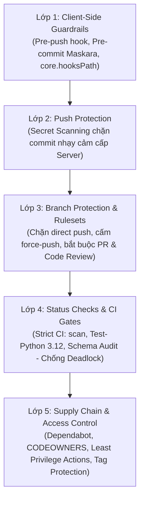

# 🛡️ SOP: Hướng Dẫn Thiết Lập Bảo Vệ Repository Trên GitHub

> **Mã quy chuẩn**: `CCBA-SOP-SEC-001`  
> **Phiên bản**: Rev 1.0 (2026)  
> **Phân tầng quản trị**: Layer 2 — Standard Operating Procedures (SOP)  
> **Thẩm quyền phê duyệt**: TRUONG_PHONG_RD_HTQT / CHU_TRI_BO_MON (QC Level 2)  
> **Tham chiếu quy chuẩn**: [ADR 0047](../adr/0047-catalog-manifest-compiler-and-frontmatter-ssot.md), [ADR 0058](../adr/0058-live-collaboration-artifacts-workspace-mirroring-and-charter-alignment.md), [Git Conventions](../rules/git_conventions.md), [Execution Guardrails](../rules/execution_guardrails.md)

---

## 1. Mục Đích & Nguyên Tắc Bảo Vệ

Quy trình thao tác chuẩn (SOP) này hướng dẫn chi tiết cách thiết lập hệ thống bảo vệ đa tầng (**5-Layer Defense-in-Depth**) cho các kho chứa mã nguồn (Repositories) trên GitHub thuộc hệ sinh thái **CCBA Platform (Hub)** và các phân vùng tri thức / công cụ vệ tinh (**Spokes**).

### 🏛️ Tại sao cần bảo vệ Repository?
Trong môi trường phát triển phần mềm hiện đại kết hợp cộng tác đa tác nhân (Multi-Agent & Multi-Client AI Agents):
1. **Ngăn chặn Direct Push:** Tuyệt đối không cho phép đẩy trực tiếp mã nguồn chưa qua kiểm thử hoặc chưa được review vào nhánh chính (`main`).
2. **Chặn rò rỉ Bí mật (Zero Secret Leaks):** Chặn đứng việc vô tình commit các API Keys nhạy cảm (LiteLLM token, Telegram bot token, OpenAI keys, Cloud credentials, Private keys).
3. **Bảo toàn lịch sử Git:** Cấm xóa nhánh chính (`main`), cấm force-push phá hủy cây lịch sử commit.
4. **Cưỡng chế cổng kiểm định tự động:** Bắt buộc 100% CI Checks và Parity Tests phải vượt qua thành công trước khi merge Pull Request (ADR-0058).
5. **Chống bẫy Deadlock:** Cấu hình các status checks đúng cách để tránh tình trạng PR bị treo vô thời hạn do bộ lọc tệp (`paths:` filter).



---

## 2. GitHub Rulesets (Khuyến Nghị Chuẩn Hiện Đại)

GitHub Rulesets là cơ chế quản trị nhánh thế hệ mới, thay thế và vượt trội hơn Classic Branch Protection nhờ khả năng quản lý tập trung, áp dụng linh hoạt theo mẫu nhánh và hỗ trợ danh sách bypass theo vai trò/ứng dụng.

### Các bước thiết lập trên GitHub Web UI:
1. Truy cập repository: **Settings** $\rightarrow$ menu bên trái chọn **Rules** $\rightarrow$ **Rulesets**.
2. Nhấn nút **New ruleset** $\rightarrow$ chọn **New branch ruleset**.
3. Điền thông tin cơ bản:
   - **Ruleset Name:** `Protect Main Branch` (hoặc `CCBA-Main-Protection`).
   - **Enforcement status:** Chuyển sang **Active** (sau khi hoàn tất cấu hình kiểm thử).
4. **Target branches:**
   - Nhấn **Add target** $\rightarrow$ chọn **Include default branch** (mặc định trỏ vào `main`).

### ⚙️ Bảng cấu hình quy tắc bắt buộc:

| Mục thiết lập | Giá trị cấu hình | Ý nghĩa & Tác dụng |
| :--- | :--- | :--- |
| **Restrict deletions** | ✅ **Enabled** | Ngăn chặn bất kỳ ai (kể cả Admin) xóa nhánh `main`. |
| **Block force pushes** | ✅ **Enabled** | Khóa hoàn toàn `git push --force` lên nhánh `main` ở cấp độ Server. *(Lưu ý: Cờ `--force-with-lease` là quy ước client-side dành riêng cho nhánh feature, không áp dụng cho `main`)*. |
| **Require a pull request before merging** | ✅ **Enabled** | Bắt buộc mọi thay đổi vào `main` đều phải thông qua Pull Request. |
| ↳ *Required approvals* | `1` (hoặc $\ge 2$ cho repo core) | Bắt buộc có tối thiểu 1 người thẩm duyệt chấp thuận. |
| ↳ *Dismiss stale pull request approvals when new commits are pushed* | ✅ **Enabled** | Khi có commit mới đẩy lên PR, toàn bộ approval trước đó bị hủy bỏ, bắt buộc review lại. |
| ↳ *Require review from Code Owners* | ✅ **Enabled** | Tự động chỉ định reviewer theo file `.github/CODEOWNERS`. |
| ↳ *Require conversation resolution before merging* | ✅ **Enabled** | Bắt buộc giải quyết xong 100% thảo luận/comments trước khi merge. |
| **Require linear history** | ✅ **Enabled** | Cấm merge commit phân nhánh lộn xộn; bắt buộc dùng Squash & Merge hoặc Rebase & Merge. |
| **Do not allow bypassing the above settings** | ✅ **Enabled** | Áp dụng rào chắn cho cả Administrators và Repository Owners (chống thao tác lỡ tay). |

---

## 3. Cấu Hình Required Status Checks & Bẫy Deadlock do Path Filtering

Cổng kiểm định tự động (Status Checks) là trái tim của chất lượng mã nguồn. Tuy nhiên, nếu cấu hình không đúng cách, repository sẽ rơi vào bẫy kẹt PR nghiêm trọng.

### 3.1. Danh Sách Status Checks Bắt Buộc Chuẩn Hóa
Trong mục **Require status checks to pass before merging** của Ruleset, bật các tùy chọn sau:
- ✅ **Require branches to be up to date before merging** (Strict Status Checks: Bắt buộc PR phải rebase/merge code mới nhất của `main` trước khi bấm merge).
- Nhấn **Add status check** và tìm kiếm chính xác các context sau:

| Tên Context Check | Nguồn Workflow | Tác dụng |
| :--- | :--- | :--- |
| `scan` | `.github/workflows/security_scan.yml` | Quét phát hiện rò rỉ bí mật, API keys, PII qua CCBA Maskara. |
| `Test - Python 3.12` | `.github/workflows/ci.yml` | Chạy bộ kiểm thử tự động trên phiên bản Python chuẩn của Platform. |
| `Deterministic Parity & Schema Audit` | `.github/workflows/ci.yml` | Kiểm định tính toàn vẹn khế ước, schema dữ liệu và kiến trúc monorepo. |

---

### 3.2. ⚠️ Cảnh Báo: Bẫy Deadlock Status Check do Path Filtering

> [!CAUTION]
> **DEADLOCK TRAP NGUY HIỂM**: Tuyệt đối **KHÔNG** đưa các job có khai báo bộ lọc `paths:` trong GitHub Actions làm Required Status Check cố định trên Ruleset (ví dụ: job `validate` từ `validate-docs.yml`).

**Cơ chế phát sinh lỗi:**
Giả sử workflow `validate-docs.yml` khai báo:
```yaml
on:
  pull_request:
    paths:
      - '**/*.md'
      - '**/*.py'
```
Khi một lập trình viên hoặc bot tạo PR chỉ chỉnh sửa các tệp cấu hình như `.gitignore`, file LICENSE, file ảnh `.png`, hoặc shell scripts `.sh`:
1. GitHub Actions đối chiếu đường dẫn và thấy không khớp bộ lọc $\rightarrow$ **Không kích hoạt job `validate`**.
2. GitHub Ruleset vẫn chờ đợi context `validate` báo về $\rightarrow$ Hiển thị trạng thái vĩnh viễn:
   ```
   Expected — Waiting for status to be reported
   ```
3. Nút Merge bị khóa cứng 100%, không ai có thể merge PR nếu không push thêm một commit giả mạo sửa file markdown/python!

**Nguyên tắc vàng:** Chỉ chọn làm Required Status Checks các jobs chạy **vô điều kiện** trên mọi Pull Request (như `ci.yml` và `security_scan.yml`).

---

## 4. Secret Scanning & Push Protection

Bảo vệ bí mật cấp độ nền tảng GitHub giúp ngăn ngừa thảm họa rò rỉ token thanh toán LLM và khóa truy cập hạ tầng.

### Các bước kích hoạt:
1. Vào **Settings** $\rightarrow$ mục **Security** bên trái chọn **Code security and analysis**.
2. Tìm đến phần **GitHub Advanced Security** (hoặc Secret Scanning cho repo Public / Private đủ điều kiện):
   - **Secret scanning:** Nhấn **Enable**. GitHub sẽ quét toàn bộ lịch sử commit để tìm kiếm các patterns bí mật đã biết.
   - **Secret scanning Push protection:** Nhấn **Enable**. 

### 🛡️ Cơ chế hoạt động của Push Protection:
Khi người dùng chạy lệnh `git push origin <branch>`:
- GitHub kiểm tra nội dung commit trước khi ghi nhận vào cơ sở dữ liệu git.
- Nếu phát hiện token (ví dụ: GitHub PAT `ghp_...`, Telegram Bot Token `123456:ABC...`, OpenAI `sk-...`, Google Gemini API Key):
  - Lệnh push bị **từ chối ngay lập tức (REJECTED)**.
  - Terminal hiển thị thông báo lỗi cụ thể vị trí file và dòng chứa secret.
  - Người dùng bắt buộc phải gỡ bỏ secret khỏi commit history hoặc dùng cơ chế secret bypass có giải trình rõ ràng.

---

## 5. Quản Lý Lỗ Hổng Phụ Thuộc (Dependabot) & Code Scanning

Bảo vệ chuỗi cung ứng phần mềm (Software Supply Chain Security) ngăn ngừa việc sử dụng các thư viện mã nguồn mở có chứa lỗ hổng bảo mật đã công bố (CVE).

### 5.1. Bật Cảnh Báo Tự Động
Tại **Settings** $\rightarrow$ **Code security and analysis**:
- **Dependency graph:** Nhấn **Enable**.
- **Dependabot alerts:** Nhấn **Enable**.
- **Dependabot security updates:** Nhấn **Enable** (Tự động mở PR nâng cấp khi phát hiện thư viện có bản vá bảo mật).

### 5.2. File Cấu Hình `.github/dependabot.yml`
Tạo file cấu hình để quản lý chu kỳ kiểm tra định kỳ (xem chi tiết tại [Mục 9](#9-mẫu-cấu-hình-sẵn-dùng-ready-to-use-templates)).

---

## 6. Phân Quyền Truy Cập Tối Thiểu (Least Privilege) & GitHub Actions Security

Mặc định, GitHub Actions có thể sở hữu quyền hạn quá mức cần thiết, tạo điều kiện cho các chuỗi tấn công supply-chain.

### 6.1. Workflow Permissions
Vào **Settings** $\rightarrow$ **Actions** $\rightarrow$ **General** $\rightarrow$ cuộn xuống **Workflow permissions**:
1. Chọn tùy chọn: **Read repository contents and packages permissions** (Chỉ cho phép đọc, cấm ghi mặc định).
2. Khi một workflow cụ thể cần ghi (như tạo Release hoặc push tag), workflow đó phải tự khai báo tường minh trong tệp YAML:
   ```yaml
   permissions:
     contents: write
   ```
3. Bỏ chọn cờ: **Allow GitHub Actions to create and approve pull requests** để chống vòng lặp bot tự duyệt PR của bot.

### 6.2. Kiểm Soát Pull Requests Từ Fork
Tại cùng trang **Actions** $\rightarrow$ **General** $\rightarrow$ mục **Fork pull request workflows**:
- Chọn: **Require approval for first-time contributors** (hoặc **Require approval for all outside collaborators** nếu là repo công khai quan trọng).
- Điều này ngăn chặn việc kẻ xấu fork repo, nhúng mã đào tiền ảo hoặc mã đánh cắp secret vào GitHub Actions runner qua PR.

---

## 7. Bảo Vệ Release & Tags (Tag Protection)

Để ngăn chặn việc ghi đè các bản phân phối chính thức hoặc phát hành tag release tùy tiện:
1. Vào **Settings** $\rightarrow$ **Tags** (hoặc **Rulesets** $\rightarrow$ **New tag ruleset**).
2. Tạo quy tắc bảo vệ:
   - **Target tags:** Chọn **Include tag pattern** $\rightarrow$ nhập `v*` (áp dụng cho mọi phiên bản như `v1.0.0`, `v2.4.1`).
   - **Quy tắc:**
     - *Restrict creation:* Chỉ cho phép Maintainers / Administrators hoặc CI token tạo tag.
     - *Restrict updates:* Chặn ghi đè (moving tag).
     - *Restrict deletions:* Chặn xóa tag đã phát hành.

---

## 8. Client-Side Git Guardrails

Bảo vệ phía máy chủ (GitHub) là tuyến phòng thủ tối thượng, nhưng bảo vệ phía máy trạm (Client-Side) giúp phát hiện sai sót sớm nhất, tiết kiệm thời gian và giữ lịch sử git sạch sẽ.

### 8.1. Bộ Đôi Hooks Chuẩn Hóa (`.githooks/`)
Repository chuẩn của CCBA Platform sử dụng thư mục được version-controlled `.githooks/` chứa cả 2 rào chắn:
1. `.githooks/pre-commit`: Chạy công cụ Maskara quét dữ liệu nhạy cảm cục bộ trước khi cho phép tạo commit.
2. `.githooks/pre-push`: Đọc `stdin` theo vòng lặp chuẩn của Git, chặn đứng lệnh push trực tiếp lên nhánh `main` và ngăn lệnh xóa nhánh `main`.

### 8.2. Kích Hoạt Hooks Trên Máy Trạm
Sau khi clone repository về máy trạm, kỹ sư chạy lệnh sau một lần duy nhất:

```bash
git config core.hooksPath .githooks
chmod +x .githooks/*
```

*(Trên Windows PowerShell: lệnh `git config core.hooksPath .githooks` là đủ; đảm bảo các tệp hook được lưu với định dạng kết thúc dòng LF thay vì CRLF qua `.gitattributes`)*.

---

## 9. Mẫu Cấu Hình Sẵn Dùng (Ready-to-Use Templates)

### 9.1. Template `.github/CODEOWNERS` (Theo 11 Ghế Hiến Chương CCBA)
Lưu tại đường dẫn: `.github/CODEOWNERS`

```text
# ==============================================================================
# CCBA Code Owners Configuration (ADR-0058 Live Governance Alignment)
# ==============================================================================

# Toàn bộ mã nguồn mặc định thuộc quyền kiểm duyệt chung
* @vvChu

# 1. Quản trị & Hiến chương Platform (Constitution, Rules, Governance)
/AGENTS.md                          @vvChu
/.agents/rules/                     @vvChu
/docs/governance/                   @vvChu
/docs/rules/                        @vvChu

# 2. Kiến trúc Monorepo & CI/CD Pipelines
/.github/workflows/                 @vvChu
/scripts/governance/                @vvChu
/pyproject.toml                     @vvChu

# 3. Gói Kỹ Thuật Pháp Điển (ccba-legal-intel & legal knowledge)
/packages/ccba-legal-intel/         @vvChu
/.agents/skills/ccba-legal-*        @vvChu

# 4. Gói Đánh Giá & Kiểm Định (ccba-harness & evals)
/packages/ccba-harness/             @vvChu
/scripts/eval/                      @vvChu

# 5. Gói Bảo Mật & Che Giấu Thông Tin (ccba-maskara)
/packages/ccba-maskara/             @vvChu
/.githooks/                         @vvChu
```

---

### 9.2. Template `.githooks/pre-push`
Lưu tại đường dẫn: `.githooks/pre-push` *(Định dạng LF, executable)*

```bash
#!/bin/sh
# ==============================================================================
# CCBA Client-Side Guardrail: Block direct push to protected branches
# Reference: CCBA-SOP-SEC-001 & ADR-0058
# ==============================================================================

protected_branch="refs/heads/main"

# Git passes ref info via standard input: <local_ref> <local_oid> <remote_ref> <remote_oid>
while read local_ref local_oid remote_ref remote_oid; do
  # Chặn push trực tiếp vào main
  if [ "$remote_ref" = "$protected_branch" ]; then
    echo "========================================================================"
    echo "❌ [CCBA Guardrail Error] Direct push to 'main' is strictly prohibited!"
    echo "========================================================================"
    echo "Vui lòng tuân thủ quy trình Factory Model:"
    echo "  1. Tạo nhánh tính năng: git checkout -b feat/your-feature-name"
    echo "  2. Commit thay đổi và push nhánh: git push origin feat/your-feature-name"
    echo "  3. Tạo Pull Request trên GitHub và đợi CI + Review kiểm định."
    echo "========================================================================"
    exit 1
  fi

  # Chặn xóa nhánh main (local_oid là chuỗi số 0)
  if [ "$local_oid" = "0000000000000000000000000000000000000000" ] && [ "$remote_ref" = "$protected_branch" ]; then
    echo "❌ [CCBA Guardrail Error] Deleting the remote 'main' branch is strictly prohibited!"
    exit 1
  fi
done

exit 0
```

---

### 9.3. Template `.githooks/pre-commit`
Lưu tại đường dẫn: `.githooks/pre-commit` *(Định dạng LF, executable)*

```bash
#!/bin/sh
# ==============================================================================
# CCBA Client-Side Guardrail: Maskara Secret & Privacy Leak Pre-Commit Scan
# Reference: CCBA-SOP-SEC-001 & ADR-0058
# ==============================================================================

echo "🔍 [CCBA Guardrail] Running Maskara secret & privacy scanner..."

# Kiểm tra xem ccba_maskara có khả dụng trong môi trường Python hiện hành không
if python -m ccba_maskara.cli --version >/dev/null 2>&1; then
  python -m ccba_maskara.cli scan --staged
  status=$?
  if [ $status -ne 0 ]; then
    echo "❌ [CCBA Guardrail Error] Sensitive tokens, keys or secrets detected in staged files!"
    echo "Vui lòng gỡ bỏ thông tin nhạy cảm trước khi commit."
    exit $status
  fi
fi

exit 0
```

---

### 9.4. Template `.github/dependabot.yml`
Lưu tại đường dẫn: `.github/dependabot.yml`

```yaml
version: 2
updates:
  # Theo dõi và cập nhật GitHub Actions
  - package-ecosystem: "github-actions"
    directory: "/"
    schedule:
      interval: "weekly"
    labels:
      - "dependencies"
      - "ci"

  # Theo dõi và cập nhật Python Dependencies
  - package-ecosystem: "pip"
    directory: "/"
    schedule:
      interval: "weekly"
    labels:
      - "dependencies"
      - "python"
    open-pull-requests-limit: 5
```

---

## 10. Checklist Nghiệm Thu 10 Điểm & Xử Lý Sự Cố (Troubleshooting)

### 📋 Checklist Nghiệm Thu Bảo Vệ Repository (Tự Đánh Giá Duyệt QC Level 2)

Maintainer hoặc Lead Engineer sử dụng bảng kiểm tra 10 điểm sau đây trước khi công bố repository:

| STT | Hạng mục kiểm tra | Tiêu chuẩn đạt | Kết quả |
| :-: | :--- | :--- | :-: |
| 1 | **Ruleset Active** | Ruleset `Protect Main Branch` ở trạng thái **Active**. | [ ] |
| 2 | **Chặn Direct Push** | Lệnh `git push origin main` bị từ chối với lỗi `Protected branch`. | [ ] |
| 3 | **Cấm Force Push** | Tùy chọn *Block force pushes* đã bật, cấm hoàn toàn push `--force` lên `main`. | [ ] |
| 4 | **Bắt Buộc PR Review** | Nhánh `main` yêu cầu tối thiểu 1 approval và dismiss stale reviews. | [ ] |
| 5 | **Strict CI Checks** | Yêu cầu branches up to date; status checks gồm `scan`, `Test - Python 3.12`, `Schema Audit`. | [ ] |
| 6 | **Không Bẫy Deadlock** | Không có status check nào bị ràng buộc bởi bộ lọc tệp `paths:`. | [ ] |
| 7 | **Push Protection Bật** | Cả hai mục *Secret scanning* và *Push protection* đã chuyển sang **Enabled**. | [ ] |
| 8 | **Workflow Permissions** | Actions permissions được đặt thành *Read repository contents and packages*. | [ ] |
| 9 | **Fork PR Gate** | Yêu cầu phê duyệt trước khi chạy runner đối với contributors bên ngoài. | [ ] |
| 10 | **Client Hooks Sẵn Sàng** | Thư mục `.githooks/` có đủ `pre-commit` & `pre-push`, `core.hooksPath` hoạt động tốt. | [ ] |

---

### 🛠️ Xử Lý Sự Cố Thường Gặp (Troubleshooting)

#### 1. Sự cố: Bị GitHub Push Protection từ chối commit vì nghi ngờ lộ secret
* **Triệu chứng:** Terminal báo lỗi: `GH009: Secrets detected! Push rejected`.
* **Khắc phục:**
  1. Tuyệt đối **không** tạo commit mới đè lên để che giấu secret vì commit cũ vẫn còn nguyên trong lịch sử git.
  2. Hủy commit cục bộ vừa tạo: `git reset HEAD~1`.
  3. Xóa bỏ hoàn toàn API key khỏi tệp nguồn, đưa vào file `.env` (đảm bảo `.env` đã có trong `.gitignore`).
  4. Thực hiện commit lại một cách an toàn.
  5. Nếu token đã vô tình bị lộ ra internet, lập tức truy cập nhà cung cấp (Google AI Studio, Telegram, GitHub) để **Thu hồi (Revoke)** và sinh token mới.

#### 2. Sự cố: Pull Request bị treo ở trạng thái "Waiting for status to be reported"
* **Triệu chứng:** PR đã pass hết các checks hiển thị nhưng nút Merge vẫn báo thiếu check.
* **Nguyên nhân:** Ruleset đang yêu cầu một job có cấu hình `paths:` filter mà commit này không chạm vào.
* **Khắc phục:**
  1. Vào **Settings** $\rightarrow$ **Rules** $\rightarrow$ **Rulesets** $\rightarrow$ chỉnh sửa ruleset `Protect Main Branch`.
  2. Kiểm tra danh sách status checks bắt buộc, gỡ bỏ job có `paths:` filter khỏi danh sách bắt buộc.
  3. Nhấn **Save changes** $\rightarrow$ Quay lại PR, trạng thái sẽ lập tức chuyển sang màu xanh **Mergeable**.

#### 3. Sự cố: Kỹ sư trên Windows chạy Git hook báo lỗi `\r: command not found`
* **Triệu chứng:** Khi commit hoặc push trên Git Bash / WSL báo lỗi ký tự xuống dòng.
* **Khắc phục:**
  1. Tệp hook đang bị lưu với định dạng CRLF (Windows line endings) thay vì LF (Unix line endings).
  2. Chuyển đổi định dạng: `dos2unix .githooks/*` hoặc mở trong VS Code chuyển sang LF và lưu lại.
  3. Đảm bảo file `.gitattributes` có khai báo: `.githooks/* text eol=lf`.
