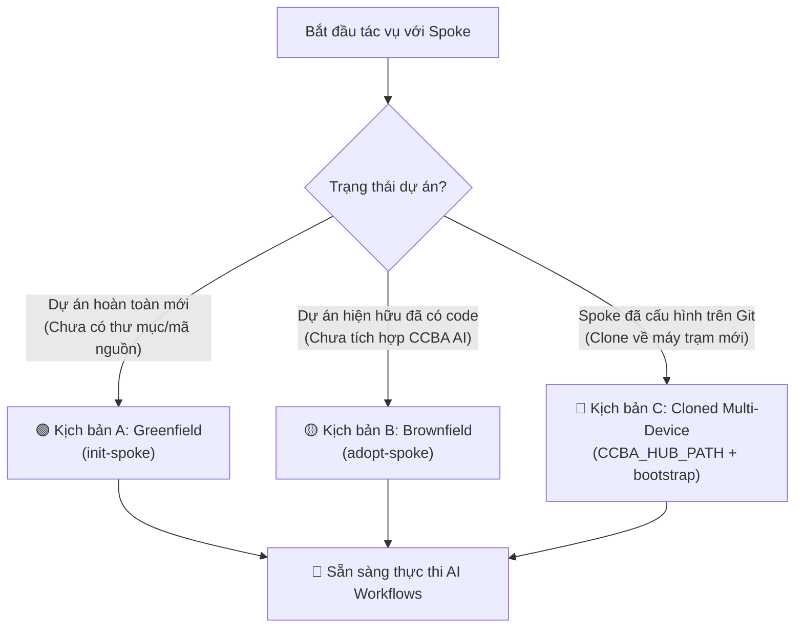
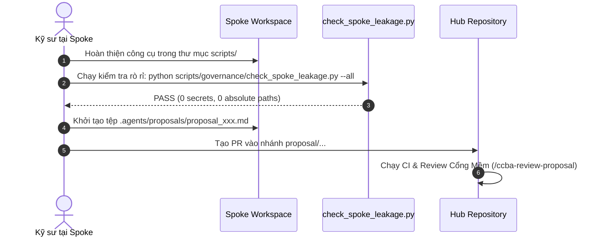

# 📘 SOP: Khởi Tạo, Tiếp Nhận & Đồng Bộ Spoke Trong Môi Trường Đa Máy

> **Mã quy trình:** `CCBA-SOP-SYNC-001`  
> **Phiên bản:** Rev 1.0 (2026)  
> **Áp dụng cho:** Kỹ sư tư vấn, Lập trình viên, Spoke Maintainers, AI Coding Agents  
> **Tham chiếu kiến trúc:** [CCBA-GOV-SYNC-2026](../governance/hub_spoke_synchronization_and_multi_device_governance.md), [ADR 0009](../adr/0009-hub-spoke-sync-and-partition-strategy.md), [ADR 0036](../adr/0036-brownfield-spoke-adoption-and-non-destructive-onboarding.md), [ADR 0041](../adr/0041-hub-spoke-ecosystem-taxonomy-and-archetypes.md), [ADR 0044](../adr/0044-spoke-hub-package-bootstrap-standard.md), [ADR 0051](../adr/0051-hub-spoke-sync-hardening-constitution-preservation-and-virtual-fallback.md), [SOP-DELIVERY-001](project_delivery_spoke_setup.md).

---

## 1. Mục Đích & Nguyên Tắc Vận Hành

Quy trình thao tác chuẩn (SOP) này hướng dẫn chi tiết các bước thiết lập, tiếp nhận, bảo trì và đồng bộ hóa một **Spoke Workspace** (Dự án tư vấn, phần mềm, kho pháp luật hoặc sandbox cá nhân) với **Central Hub** (`ccba-agent-platform`).

### 🏛️ Các Nguyên Tắc Bất Biến (Core Operational Invariants):
1. **Quy chế 2-Phase Safe-by-Default:** Mọi thao tác đồng bộ trong môi trường non-interactive (CI, scripts tự động) mặc định chỉ chạy ở chế độ **xem trước (preview)**. Để thay đổi có hiệu lực trên đĩa, cờ `--apply` (hoặc `-y`) là **bắt buộc**.
2. **Cô lập Trạng thái Máy (Machine-State Decoupling):** Tuyệt đối cấm commit đường dẫn tuyệt đối (`C:\...`, `D:\...`) vào Git. Vị trí Hub được phân giải độc lập trên từng máy qua biến môi trường `CCBA_HUB_PATH`.
3. **Cấm Tái Khởi Tạo Trên Repo Đã Clone:** Khi kéo một Spoke đã có sẵn tệp cấu hình `.md/workspace_context.yaml` về máy mới, cấm tuyệt đối chạy lại lệnh khởi tạo (`init-spoke`) hay tiếp nhận (`adopt-spoke`). Chỉ cần thiết lập biến môi trường và chạy script kích hoạt môi trường ảo.

---

## 2. Bảng Tra Cứu Cờ Lệnh Động Cơ Đồng Bộ (`sync_spoke.py`)

Lệnh đồng bộ Spoke được thực thi thông qua facade `scripts/sync_spoke.py` từ thư mục gốc của Hub hoặc Spoke.

| Cờ Lệnh | Tên Đầy Đủ | Mục Đích & Hành Vi |
| :--- | :--- | :--- |
| *(Không cờ)* | Default (Dry-run) | Kiểm tra dò tìm Hub, phân tích chênh lệch và hiển thị preview bảng thay đổi. **Không ghi bất kỳ tệp nào vào đĩa.** |
| `--apply`, `-y` | Apply Changes | **Bắt buộc để ghi đĩa.** Áp dụng toàn bộ thay đổi, cập nhật `AGENTS.md` và sao chép các kỹ năng theo bundle. |
| `--dry-run` | Dry-run Mode | Minh định chạy ở chế độ mô phỏng kiểm tra, an toàn tuyệt đối. |
| `--force`, `-f` | Ignore Dirty Git | Bỏ qua cảnh báo uncommitted changes trong git working tree (lưu ý: vẫn cần `--apply` để ghi đĩa). |
| `--spoke <path>` | Target Spoke | Chỉ định đường dẫn tới thư mục gốc của Spoke cần đồng bộ (mặc định là thư mục hiện tại `.`). |
| `--sync-item <name>` | On-demand Skill | Tải và đồng bộ vật lý một kỹ năng cụ thể (ví dụ: `--sync-item ccba-legal-advisor --apply`) phục vụ autocomplete IDE. |
| `--rollback` | Rollback Engine | Khôi phục ngay lập tức trạng thái Spoke về bản snapshot gần nhất trước lần sync cuối cùng. |
| `--list-backups` | List Snapshots | Liệt kê toàn bộ các bản snapshot sao lưu an toàn trong thư mục `.md/backup/`. |
| `--all` | Multi-Spoke Sync | Quét và đồng bộ hàng loạt toàn bộ các Spokes đã đăng ký trong `spoke_registry.yaml`. |

---

## 3. 3 Kịch Bản Vận Hành Thực Tế (Operational Runbooks)



---

### 🟢 KỊCH BẢN A: KHỞI TẠO SPOKE MỚI (GREENFIELD RUNBOOK)

Áp dụng khi tạo mới một không gian làm việc từ đầu. Khởi tạo tất định qua bộ công cụ CLI.

#### Bước A.1: Thực thi lệnh Khởi tạo Tất định
Tại thư mục gốc của Hub (`ccba-agent-platform`), chạy lệnh `init-spoke`:

- **Khởi tạo Project Delivery Spoke (Thẩm tra thiết kế trên OneDrive):**
  ```powershell
  # Windows PowerShell
  python scripts/ccba_platform_cli.py init-spoke `
      --path "D:\OneDrive - IBST BIM\00 Works\2026-09 Du An Mau" `
      --name "2026-09-Du-An-Mau" `
      --archetype project_delivery `
      --type "Thẩm tra thiết kế" `
      --sync `
      --bootstrap
  ```

- **Khởi tạo Specialized Extension Spoke (Phát triển module phần mềm trên Linux):**
  ```bash
  # Linux / macOS / WSL
  python scripts/ccba_platform_cli.py init-spoke \
      --path "/home/vvc/ccba/spokes/cad-analyzer" \
      --name "cad-analyzer" \
      --archetype specialized_extension \
      --sub-type personal_sandbox \
      --type "Phần mềm" \
      --init-git \
      --sync \
      --bootstrap
  ```

#### Bước A.2: Kiểm tra cấu trúc được sinh ra
Hệ thống tự động thiết lập:
- Khung `.md/`: Chứa `.md/INDEX.md`, `.md/knowledge/`, `.md/extracted_docs/`, `.md/archive/`.
- Cấu hình chuẩn `.md/workspace_context.yaml`.
- Tệp `.gitignore` bảo vệ máy trạm (chặn `.worktrees/`, `.env*`, `requirements-hub.txt`).
- Hiến pháp `.agents/AGENTS.md` tích hợp sẵn Virtual Hub Fallback.

---

### 🟡 KỊCH BẢN B: TIẾP NHẬN DỰ ÁN CŨ (BROWNFIELD ADOPTION RUNBOOK)

Áp dụng cho các kho mã nguồn hoặc dự án tư vấn đã tồn tại từ trước (ADR-0036). Lệnh tiếp nhận sẽ **không can thiệp hoặc thay đổi cấu trúc mã nguồn hiện có**.

#### Bước B.1: Chạy lệnh Adopt Spoke
```bash
# Thực thi từ Hub trỏ tới thư mục dự án cũ (mặc định sẽ áp dụng thay đổi; dùng --dry-run để xem trước)
python scripts/adopt_spoke.py \
    --spoke "/path/to/legacy-project" \
    --archetype project_delivery \
    --type "BIM"

# Hoặc thực thi qua CLI hợp nhất:
# python scripts/ccba_platform_cli.py adopt-spoke "/path/to/legacy-project" --archetype project_delivery --type "BIM"
```

#### Bước B.2: Bổ sung Bundles Kỹ Năng Bổ Sung (Nếu Cần)
Nếu dự án cũ cần dùng thêm các kỹ năng ngoài bundle mặc định, mở tệp `.md/workspace_context.yaml` tại Spoke và bổ sung:
```yaml
additional_bundles:
  - _qc
  - _consulting
```
Sau đó tiến hành đồng bộ:
```bash
python /path/to/hub/scripts/sync_spoke.py --spoke . --apply
```

---

### 🔵 KỊCH BẢN C: ONBOARDING SPOKE ĐÃ CÓ SẴN TRÊN MÁY MỚI (CLONED MULTI-DEVICE)

Áp dụng khi kỹ sư clone một Spoke đã có sẵn từ GitHub về máy tính mới (ví dụ: chuyển từ PC Windows sang Laptop Linux).

> [!CAUTION]
> **CẤM TÁI KHỞI TẠO:** Tuyệt đối **không chạy lại** `init-spoke` hoặc `adopt-spoke`. Tệp `.md/workspace_context.yaml` đã tồn tại trên repository, việc chạy lại sẽ bị Fail-Safe Gate chặn đứng hoặc ghi đè cấu hình.

#### Bước C.1: Cấu hình Biến Môi Trường `CCBA_HUB_PATH`

- **Trên Windows (PowerShell Profile):**
  Mở file profile bằng `notepad $PROFILE` và thêm dòng sau:
  ```powershell
  $env:CCBA_HUB_PATH = "D:\GitHubProjects\ccba-agent-platform"
  ```
  *(Lưu lại và mở phiên PowerShell mới để biến có hiệu lực).*

- **Trên Linux / WSL (`~/.bashrc` hoặc `~/.zshrc`):**
  ```bash
  echo 'export CCBA_HUB_PATH="/home/vvc/ccba/ccba-agent-platform"' >> ~/.bashrc
  source ~/.bashrc
  ```

#### Bước C.2: Kích hoạt Môi Trường Ảo & Packages Liên Kết
Tại thư mục gốc của Spoke vừa clone:
```bash
# Tạo môi trường ảo và cài đặt liên kết editable package từ Hub
python "$CCBA_HUB_PATH/scripts/spoke/spoke_bootstrap.py" --create-venv
```
Toàn bộ các gói trong `hub_packages` sẽ được cài đặt liên kết vào `.venv` của Spoke qua file cục bộ `requirements-hub.txt` mà không làm thay đổi trạng thái git working tree.

---

## 4. Quy Trình Bảo Trì & Đồng Bộ Định Kỳ (Routine Maintenance)

Khi Hub có cập nhật mới về Hiến pháp, quy tắc hoặc kỹ năng:

### 4.1. Xem trước thay đổi (Preview Phase)
Tại thư mục gốc của Spoke:
```bash
python "$CCBA_HUB_PATH/scripts/sync_spoke.py"
```
Động cơ sẽ in bảng tóm tắt:
- Trạng thái `AGENTS.md` (giữ nguyên các mục `## Agent skills` và custom sections).
- Danh sách skills/workflows sẽ được cập nhật hoặc làm sạch.

### 4.2. Phê duyệt & Áp dụng thay đổi (Apply Phase)
```bash
python "$CCBA_HUB_PATH/scripts/sync_spoke.py" --apply
```
Nếu working tree của Spoke đang có uncommitted changes mà vẫn muốn ép đồng bộ:
```bash
python "$CCBA_HUB_PATH/scripts/sync_spoke.py" --apply --force
```

### 4.3. Khôi phục nhanh khi xảy ra sự cố (Rollback Protocol)
Nếu quá trình sync gây ra lỗi ngoài dự kiến:
```bash
# Xem danh sách các bản lưu an toàn
python "$CCBA_HUB_PATH/scripts/sync_spoke.py" --list-backups

# Khôi phục về bản snapshot gần nhất
python "$CCBA_HUB_PATH/scripts/sync_spoke.py" --rollback
```

---

## 5. Quy Trình Đóng Góp Ngược Lên Hub (Upstream Proposal Runbook)

Khi Spoke phát triển được một công cụ hoặc kỹ năng hữu ích và muốn đề bạt lên Central Hub (ADR-0045):



1. **Khử trùng cục bộ:** Chạy kiểm tra rò rỉ đường dẫn và tệp rác:
   ```bash
   python "$CCBA_HUB_PATH/scripts/governance/check_spoke_leakage.py" --all
   ```
2. **Soạn thảo đề xuất:** Sao chép từ template `$CCBA_HUB_PATH/.agents/proposals/TEMPLATE.md` vào Spoke và điền đầy đủ metadata.
3. **Tạo PR:** Đẩy lên remote và gửi Pull Request theo hướng dẫn chi tiết tại [spoke_to_hub_proposal_guide.md](../governance/spoke_to_hub_proposal_guide.md).

---

## 6. Sổ Tay Xử Lý Sự Cố Thường Gặp (Troubleshooting Runbook)

### Sự cố 1: `ImportError` hoặc `ModuleNotFoundError` khi chạy kỹ năng qua Virtual Hub Fallback
- **Nguyên nhân:** Kỹ năng đã được Agent đọc nội dung từ Hub qua Virtual Fallback, nhưng Spoke chưa cài đặt thư viện Python tương ứng (chưa liên kết `hub_packages`).
- **Khắc phục:**
  1. Mở `.md/workspace_context.yaml` tại Spoke, kiểm tra xem gói cần thiết (ví dụ: `ccba-legal-intel`) đã có trong danh sách `hub_packages` chưa.
  2. Chạy lệnh cài đặt liên kết:
     ```bash
     python "$CCBA_HUB_PATH/scripts/spoke/spoke_bootstrap.py"
     ```

### Sự cố 2: Bị mất cấu hình riêng khi đồng bộ `AGENTS.md`
- **Nguyên nhân:** Các quy tắc riêng của Spoke bị đặt lẫn vào mục `## Core Invariants` với key trùng với Hub, dẫn đến việc bị Hub Invariant ghi đè.
- **Khắc phục:**
  1. Khôi phục lại bản trước khi sync: `python "$CCBA_HUB_PATH/scripts/sync_spoke.py" --rollback`.
  2. Chuyển toàn bộ các quy tắc đặc thù của dự án sang một heading độc lập, ví dụ:
     ```markdown
     ## Project Custom Invariants
     - **Project Code**: 2026-09-ABC
     - **Security Level**: Confidential
     ```
  3. Chạy lại lệnh đồng bộ: `python "$CCBA_HUB_PATH/scripts/sync_spoke.py" --apply`.

### Sự cố 3: Cảnh báo rò rỉ đường dẫn Windows `[FAIL] Absolute path detected`
- **Nguyên nhân:** Script hoặc tài liệu markdown chứa đường dẫn tuyệt đối dạng `D:\...` hoặc `C:\Users\...`.
- **Khắc phục:**
  1. Chuyển đường dẫn thành đường dẫn tương đối (`./docs/...`).
  2. Nếu đó là đường dẫn fallback mặc định hợp lệ trên Windows trong mã nguồn Python, gắn thêm comment miễn trừ:
     ```python
     DEFAULT_PATH = r"D:\GitHubProjects\ccba-agent-platform"  # ccba:allow-machine-path
     ```

### Sự cố 4: Va chạm Claim Lock (`Issue is currently locked by peer agent`)
- **Nguyên nhân:** Một tác tử khác trên máy trạm khác đang xử lý issue hoặc chưa hết hạn TTL (24h).
- **Khắc phục:**
  1. Kiểm tra timestamp trong comment `<!-- CCBA_PEER_CLAIM_LOCK ... -->` trên GitHub Issue.
  2. Nếu thời gian claim đã vượt quá 24h mà không có hoạt động commit mới $\rightarrow$ Kích hoạt giao thức Takeover (tiếp quản an toàn).
  3. Nếu thời gian claim còn hiệu lực $(< 24\text{h})$: Nhượng bộ và chọn issue khác từ Backlog.

---

*Tài liệu SOP được ban hành bởi CCBA Architecture & Operations Board.*
