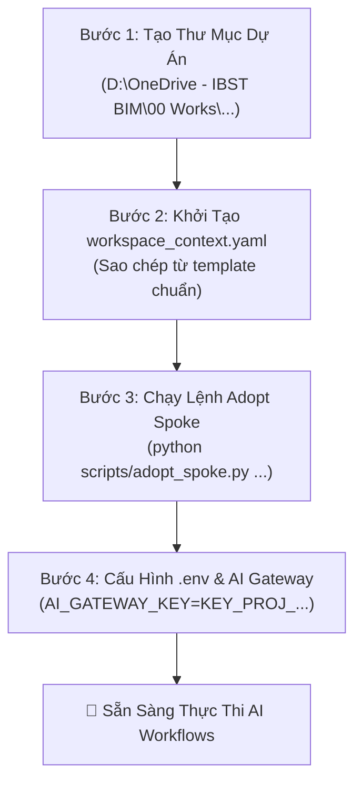

# 📘 SOP: Khởi Tạo & Vận Hành Project Delivery Spoke Trên OneDrive / SharePoint

> **Mã quy trình**: `CCBA-SOP-DELIVERY-001`  
> **Phiên bản**: Rev 1.0 (2026)  
> **Áp dụng cho**: Chủ trì hợp đồng (PM), Chủ trì bộ môn, Kỹ sư thẩm tra / kiểm định / BIM  
> **Tham chiếu**: [ADR 0041](../../docs/adr/0041-hub-spoke-ecosystem-taxonomy-and-archetypes.md), [ADR 0042](../../docs/adr/0042-tiered-ai-pre-submission-gate-and-tri-repo-sync.md), [ADR 0043](../../docs/adr/0043-idop-active-dev-resilience-and-fallback.md), [ADR 0044](../../docs/adr/0044-spoke-hub-package-bootstrap-standard.md)  

---

## 1. Mục Đích & Phạm Vi Áp Dụng

Quy trình thao tác chuẩn (SOP) này hướng dẫn chi tiết các bước thiết lập, cấu hình và vận hành một **Project Delivery Spoke** (Không gian làm việc dự án tư vấn / thẩm tra / kiểm định) trên môi trường thư mục đồng bộ đám mây OneDrive của Viện IBST.

### 🏛️ Các Nguyên Tắc Bất Biến (Core Invariants):
1. **Không Sử Dụng Git Remote**: Dự án tư vấn sản xuất hồ sơ thực tế chứa các tệp nhạy cảm của khách hàng và các tệp đồ họa dung lượng lớn (Revit `.rvt`, AutoCAD `.dwg`, PDF scan). Tuyệt đối **không** tạo kho Git remote công khai hoặc đẩy lên GitHub.
2. **Đồng Bộ Xuôi 1 Chiều (Downstream Sync)**: Spoke dự án kế thừa 100% Kỹ năng (`.agents/skills/`) và Quy trình (`.agents/workflows/`) từ Central Hub (`ccba-agent-platform`) thông qua công cụ đồng bộ cục bộ.
3. **Local-First IDOP Staging**: Toàn bộ biên bản, báo cáo thẩm tra và kết quả kiểm định được lưu tạm thời vào hàng đợi `.md/idop_staged/` trước khi đồng bộ lên 58 SharePoint Lists và CDE Master.

---

## 2. Quy Trình Khởi Tạo 4 Bước (4-Step Bootstrap Runbook)



---

### 📂 BƯỚC 1: TẠO THƯ MỤC DỰ ÁN TRÊN ONEDRIVE

Tạo thư mục dự án theo cấu trúc **Golden Layout** tại ổ đĩa `D:\`:

```powershell
# Cấu trúc đặt tên chuẩn: YYYY-MM [Mã_Dự_Án] [Tên_Viết_Tắt]
$PROJECT_DIR = "D:\OneDrive - IBST BIM\00 Works\2026-04 DH Viet Nhat"
New-Item -ItemType Directory -Path $PROJECT_DIR -Force
cd $PROJECT_DIR
```

---

### 📄 BƯỚC 2: KHỞI TẠO CẤU HÌNH DỰ ÁN (`workspace_context.yaml`)

Tạo thư mục `.md` và sao chép tệp cấu hình mẫu từ Hub:

```powershell
New-Item -ItemType Directory -Path "$PROJECT_DIR\.md" -Force

# Sao chép template từ Hub sang Spoke
Copy-Item "D:\GitHubProjects\ccba-agent-platform\templates\workspace_context.delivery.yaml" `
          -Destination "$PROJECT_DIR\.md\workspace_context.yaml"
```

Chỉnh sửa tệp `.md\workspace_context.yaml` để cập nhật thông tin thực tế:
- `project.name`: Tên thư mục dự án.
- `project.project_code`: Mã dự án theo IDOP (ví dụ `2026-04-DH-VIET-NHAT`).
- `project.type`: Chọn `Thẩm tra thiết kế` / `Kiểm định` / `Thiết kế` / `BIM`.
- `organizational_identity`: Cập nhật `owner_name`, `owner_email`, `department`, `seat_role`.
- `qc_governance.authorized_qc_level`: Thiết lập cấp thẩm tra tối đa (`LEVEL_2` đến `LEVEL_5`).

---

### 🔄 BƯỚC 3: ĐỒNG BỘ KỸ NĂNG & WORKFLOWS TỪ HUB

Tại thư mục Hub, thực thi lệnh `adopt_spoke.py` để tự động sao chép các kỹ năng và workflows tương ứng với bundle của dự án:

```powershell
# Đứng tại thư mục Hub ccba-agent-platform
cd D:\GitHubProjects\ccba-agent-platform

# Kích hoạt đồng bộ xuôi vào Spoke dự án
python scripts/adopt_spoke.py `
  --spoke "$PROJECT_DIR" `
  --archetype "project_delivery" `
  --type "Thẩm tra thiết kế" `
  --mode "consulting"
```

Lệnh này sẽ tự động:
1. Đọc tệp `.md/workspace_context.yaml`.
2. Tạo thư mục `.agents/workflows/` và `.agents/skills/` trong Spoke dự án.
3. Sao chép các workflows thẩm tra chuyên dụng (`workflow_pccc_cdt_tuthamdinh.md`, `ccba-ai-qc-pccc-audit.md`, `ccba-completion-checklist.md`).
4. Cài đặt các hook bảo vệ và rào chắn an toàn dữ liệu.

---

### 🔑 BƯỚC 4: THIẾT LẬP KẾT NỐI AI GATEWAY (`.env`)

Tạo tệp `.env` tại thư mục gốc của Spoke dự án:

```env
AI_GATEWAY_URL=http://100.83.192.30:8090/v1
AI_GATEWAY_KEY=KEY_PROJ_2026_04_DH_VIET_NHAT
AI_MODEL=gemini-3.7-flash
```

> [!NOTE]
> Khóa `AI_GATEWAY_KEY` thuộc Tier 2 (Project Delivery) được cấp phát tự động theo mã dự án và có quyền gọi các mô hình Deep Reasoning & Multimodal Vision Quad-view.

---

## 3. Vận Hành & Thực Thi AI Workflows Trong Dự Án

Sau khi hoàn tất khởi tạo, Kỹ sư mở thư mục dự án trong Antigravity IDE hoặc Visual Studio Code và có thể thực thi ngay các lệnh:

### 1. Thẩm Tra Chất Lượng Bản Vẽ PCCC (Quad-view Vision)
```text
/workflow_pccc_cdt_tuthamdinh
```
Hoặc:
```text
/ccba-ai-qc-pccc-audit
```
*Tác dụng*: Tự động trích xuất bản vẽ CAD/PDF, chia 4 góc nhìn (Quad-view), đối chiếu với QCVN 06:2022/BXD và Sửa đổi 1:2023, xuất báo cáo thẩm tra Markdown và bảng tổng hợp lỗi.

### 2. Lập Danh Mục Hồ Sơ Hoàn Thành Công Trình
```text
/ccba-to-questionnaire
```
Hoặc kích hoạt skill `completion-checklist` để lập danh mục hồ sơ nghiệm thu hoàn thành công trình theo Luật Xây dựng 2025 và Nghị định 105/2025/NĐ-CP.

---

## 4. Đóng Gói & Bàn Giao Hồ Sơ Vào IDOP

Khi hoàn thành một mốc tiến độ hoặc có sản phẩm cần trình duyệt:

1. Agent hoặc Kỹ sư lưu sản phẩm cuối cùng vào thư mục bàn giao:
   ```text
   $PROJECT_DIR\.md\idop_staged\
   ```
2. Tệp tin sẽ tự động được gán nhãn biên nhận PGV (ví dụ `PGV-2026-08-014.json`).
3. Cầu nối `IDOPBridge` sẽ đẩy các bản ghi lên SharePoint Lists của Viện IBST khi có kết nối mạng.

---

## 5. Bảo Trì & Cập Nhật Kỹ Năng Mới Từ Hub

Khi Hub có thêm các quy trình kiểm tra hoặc tiêu chuẩn mới, PM dự án chỉ cần chạy lệnh cập nhật:

```powershell
cd D:\GitHubProjects\ccba-agent-platform
python scripts/sync_spoke.py --spoke "D:\OneDrive - IBST BIM\00 Works\2026-04 DH Viet Nhat"
```

Lệnh cập nhật sẽ giữ nguyên toàn bộ dữ liệu dự án hiện có và chỉ ghi đè các workflows/skills của hệ thống.
