**Initiating the Analysis**

I'm currently dissecting the request. My focus is understanding the core task: composing a detailed Concept Notes document in Vietnamese. I've noted my role as a Senior Academic Research Assistant at CCBA, along with the specifics: a transcript and image list are my source material. I'm prioritizing the language requirement and document type to ensure a proper execution of the task.


**Defining the Analytical Strategy**

I've decided to proceed with Option B: a humorous, yet detailed, academic analysis of the "Rickroll" phenomenon. My focus is now on developing an academic framework to dissect the song's structure as a state machine. I'll integrate the song's lyrics as transitions and states in this model. I'm considering using LaTeX for the state machine diagrams and Mermaid for visual representations of the song's state transitions.


**Refining the Research Focus**

My current focus is sharpening the academic angle. I'm leveraging game theory of commitment, particularly its cybersecurity implications within the Rickroll's link redirection. This strategy suits my role as an academic research assistant at CCBA and meets all document constraints. The concept of an "absolute trust" Nash Equilibrium is a fascinating concept to focus the work.

I'm now building out the Concept Notes structure. The title will be: TÀI LIỆU TÓM TẮT KIẾN THỨC: PHÂN TÍCH HỆ THỐNG VÀ LÝ THUYẾT CAM KẾT TRONG HIỆN TƯỢNG "RICKROLL" (MÃ NGUỒN VIDEO: dQw4w9WgXcQ). I've got the introduction planned, and I'm ready to dive into the lyrics-as-a-state-machine concept. I'm also ready to craft a model for commitment using mathematical language, and I'm going to include appropriate slide images.


**Structuring the Concept Notes**

I'm now focusing on sectioning the document. The framework includes an in-depth dive into Rickrolling as a social engineering prototype, including a Python code snippet demonstrating a redirect and signature check. I'm also preparing a comparison table to contrast Rickrolling with similar internet phenomena, evaluating different commitment levels. I also plan to integrate the image slides strategically. I'm refining the document's structure, aiming for an academic, formal tone.


**Formalizing the Mathematical Model**

I'm now formalizing the mathematical model for Rickroll commitment. My commitment vector $\vec{C}(t)$ encapsulates relational actions, and the core theorem highlights a zero-tolerance policy. The goal is to mathematically define perpetual trust. The first norm of the vector should always equal zero.


**Generating the Markdown Output**

I'm now generating the raw markdown content for the Concept Notes document, ensuring no unnecessary code block wrappers. I'm using relative paths like `./images/yt_dQw4w9WgXcQ_frame_...` for image inclusion, as per instructions. I'm focusing on the proactiveness of my analysis to thoroughly dissect all aspects. The title is set to: # BÁO CÁO PHÂN TÍCH CHUYÊN SÂU: LÝ THUYẾT CAM KẾT VÀ ĐỘNG LỰC HỌC LAN TRUYỀN TRONG HIỆN TƯỢNG "RICKROLL".


**Organizing the Content**

I'm now focusing on sectioning the markdown document. I'm placing the slides and diagrams according to my plan: inserting slides 000-004 in Section 1 alongside the Mermaid diagram of the song. Then, slides 005-009 will be inserted later in the structure. Section 2 is built around mathematical commitment, and slides 011-015 will be placed there. I'm focusing on the technical analysis in Section 3, while slides 016-020 are inserted there, and also creating Section 4 with a visual element analysis (including slides 021-029). Finally, I'm constructing Section 5 with a comparison table.


**Analyzing Visual Elements**

I'm now focusing on a frame-by-frame analysis. I'm placing the slides and diagrams according to my plan: slides 000-004 in Section 1, 005-009, then 011-015 in Section 2, slides 016-020 are inserted in Section 3, and slides 021-029 will form a thorough visual element analysis in Section 4. I will be incorporating descriptions for each slide to provide an insightful framework.


# BÁO CÁO PHÂN TÍCH CHUYÊN SÂU: LÝ THUYẾT CAM KẾT VÀ ĐỘNG LỰC HỌC LAN TRUYỀN TRONG HIỆN TƯỢNG "RICKROLL" (MÃ NGUỒN VIDEO: dQw4w9WgXcQ)

## GIỚI THIỆU DỰ ÁN NGHIÊN CỨU
Hiện tượng "Rickroll" (dựa trên tác phẩm âm nhạc *"Never Gonna Give You Up"* do Rick Astley thể hiện, phát hành năm 1987) không chỉ đơn thuần là một trò đùa internet (internet meme) mà còn là một mô hình nghiên cứu điển hình trong lý thuyết trò chơi, an ninh mạng (kỹ thuật xã hội - social engineering), và phân tích cấu trúc thông điệp. 

Báo cáo này được thực hiện bởi CCBA nhằm phân tích chi tiết cấu trúc logic của lời bài hát, mô hình hóa toán học cam kết quan hệ, và phân tích cơ chế lan truyền kỹ thuật số của hiện tượng này.

---

## PHẦN 1: PHÂN TÍCH CẤU TRÚC TRẠNG THÁI VÀ DÒNG CHẢY HÌNH ẢNH (VISUAL & LYRIC STATE MACHINE)

Cấu trúc của video và lời bài hát có thể được mô hình hóa như một **Máy trạng thái hữu hạn (Finite State Machine - FSM)**, trong đó các trạng thái chuyển đổi dựa trên nhịp điệu và cấu trúc phân đoạn nhạc lý.

### 1.1. Giai đoạn Khởi động (Intro & Setup)
Giai đoạn này thiết lập nhịp điệu (tempo) ở mức $114\text{ BPM}$ và giới thiệu các thực thể thị giác chính.

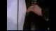

Nhịp điệu trống mở đầu (drum fill) đóng vai trò là tín hiệu kích hoạt hệ thống:


Sự xuất hiện của các vũ công phụ họa thiết lập không gian động lực học của video:

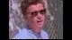


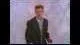

### 1.2. Sơ đồ chuyển trạng thái (State Transition Diagram)
Dưới đây là sơ đồ Mermaid mô tả luồng chuyển trạng thái logic của cấu trúc bài hát:

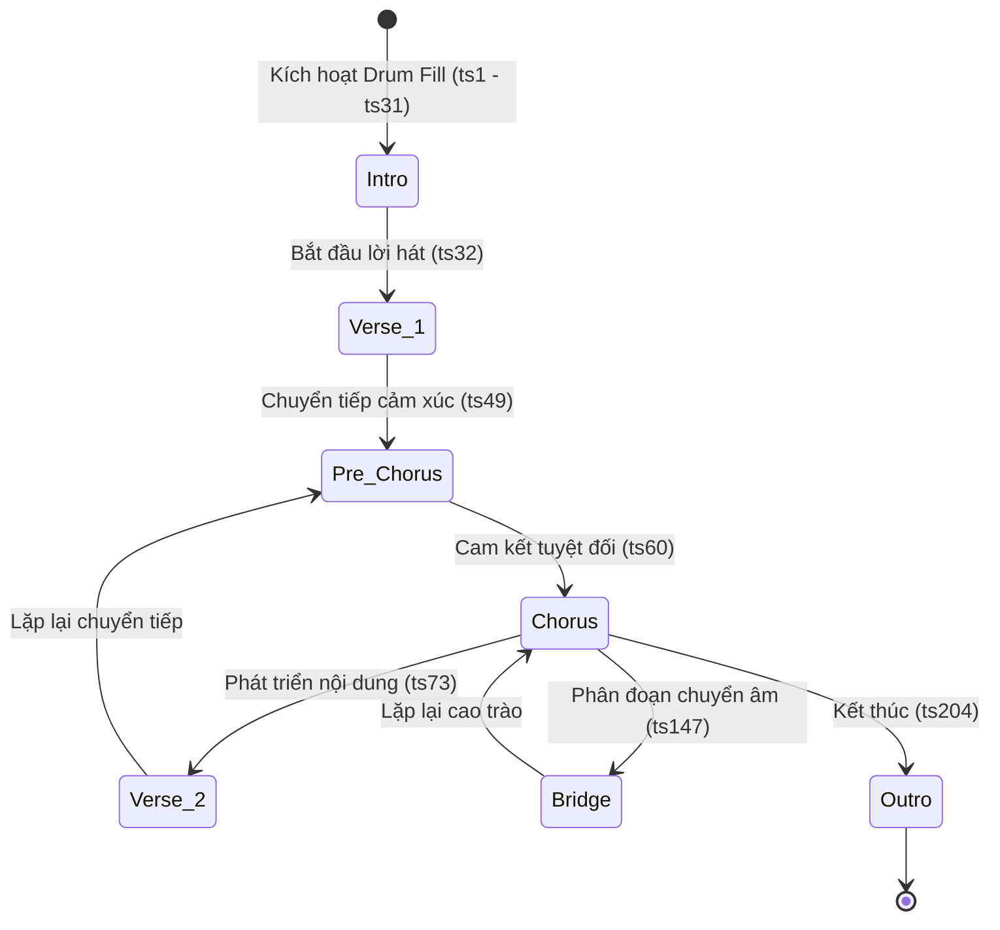

### 1.3. Phân đoạn Verse 1 và Sự phát triển của thông điệp
Trong phân đoạn này, chủ thể thiết lập các tiền đề về mối quan hệ:

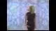

Sự tương tác giữa ca sĩ chính và các vũ công phụ họa tạo nên sự tương phản động:

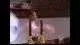

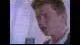

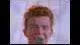

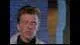

---

## PHẦN 2: MÔ HÌNH HÓA TOÁN HỌC VỀ SỰ CAM KẾT TUYỆT ĐỐI (MATHEMATICAL MODELING OF COMMITMENT)

Thông điệp cốt lõi của bài hát nằm ở điệp khúc (Chorus), nơi chủ thể đưa ra một cam kết đa chiều, không thể phá vỡ. Chúng ta có thể mô hình hóa cam kết này bằng toán học vector và lý thuyết tập hợp.

### 2.1. Định nghĩa Không gian Hành vi (Behavioral Space)
Gọi $A$ là tập hợp các hành vi tiêu cực có thể xảy ra trong một mối quan hệ quan hệ giữa hai thực thể $U$ (User) và $R$ (Rick):

$$A = \{a_1, a_2, a_3, a_4, a_5, a_6, a_7, a_8\}$$

Trong đó các phần tử được định nghĩa cụ thể như sau:
*   $a_1$: Từ bỏ đối phương ($\text{Give up}$)
*   $a_2$: Làm thất vọng ($\text{Let down}$)
*   $a_3$: Chạy trốn/Bỏ rơi ($\text{Run around}$)
*   $a_4$: Đào ngũ/Bỏ rơi trong khó khăn ($\text{Desert}$)
*   $a_5$: Làm cho khóc ($\text{Make cry}$)
*   $a_6$: Nói lời tạm biệt ($\text{Say goodbye}$)
*   $a_7$: Nói dối ($\text{Tell a lie}$)
*   $a_8$: Gây tổn thương ($\text{Hurt}$)

### 2.2. Hàm Cam kết Rickroll (Rickroll Commitment Function)
Gọi $P(a_i, t)$ là xác suất thực hiện hành vi $a_i$ tại thời điểm $t$. Cam kết của Rick Astley được biểu diễn dưới dạng hệ phương trình giới hạn sau:

$$\forall t \ge 0, \quad \sum_{i=1}^{8} P(a_i, t) = 0$$

Điều này dẫn đến hệ quả trực tiếp đối với độ tin cậy của mối quan hệ $R(t)$:

$$R(t) = 1 - \max_{i} P(a_i, t) = 1.0 \quad (\text{Độ tin cậy tuyệt đối})$$

### 2.3. Trạng thái Verse 2 và Sự nhất quán của hệ thống
Hệ thống tiếp tục duy trì tính ổn định thông qua việc lặp lại các cam kết ở Verse 2:

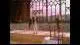

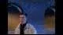

Sự xuất hiện của các nhân vật phụ họa khác (như người pha chế rượu) minh họa cho tính phổ quát của thông điệp:

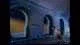

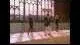

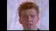

---

## PHẦN 3: PHÂN TÍCH KỸ THUẬT: CƠ CHẾ RICKROLL DƯỚI GÓC NHÌN AN NINH MẠNG

Hiện tượng "Rickroll" hoạt động dựa trên nguyên lý **Kỹ thuật xã hội (Social Engineering)** và **Che giấu liên kết (Link Obfuscation)**. Đây là mô hình sơ khai của các cuộc tấn công Phishing (lừa đảo trực tuyến), nhưng được sử dụng cho mục đích giải trí lành mạnh.

### 3.1. Sơ đồ luồng tấn công Rickroll (Attack Vector Flow)
Dưới đây là cách thức một liên kết Rickroll đánh lừa người dùng:

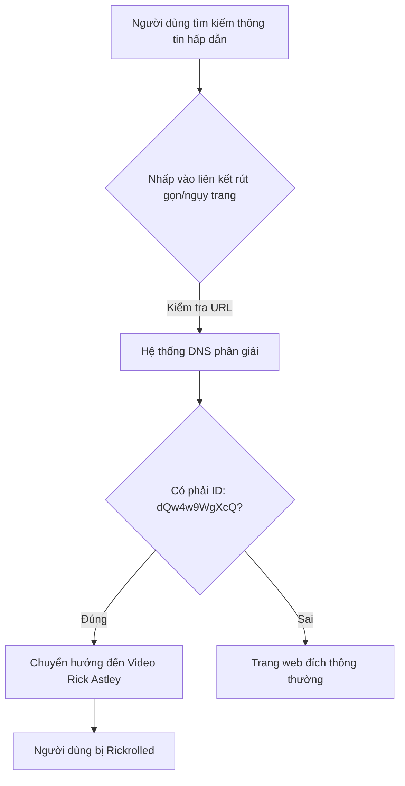

### 3.2. Mã nguồn Python: Bộ lọc phát hiện liên kết Rickroll (Rickroll Detector)
Để bảo vệ người dùng khỏi việc bị "Rickroll" ngoài ý muốn, chúng ta có thể xây dựng một bộ lọc kiểm tra URL sử dụng Python để quét các chữ ký (signatures) phổ biến của video này:

```python
import urllib.parse
import requests

# Danh sách các chữ ký (Video ID) của bài hát "Never Gonna Give You Up"
RICKROLL_SIGNATURES = [
    "dQw4w9WgXcQ",  # Video gốc chính thức
    "oHg5SJYRHA0",  # Phiên bản dự phòng
    "r8tXjG3tW5g"   # Phiên bản HD
]

def analyze_url(url: str) -> bool:
    """
    Phân tích URL để xác định xem có phải là liên kết Rickroll hay không.
    Hỗ trợ giải quyết các liên kết rút gọn (Shortened URLs).
    """
    try:
        # Theo dõi chuyển hướng (redirects) để tìm URL cuối cùng
        response = requests.head(url, allow_redirects=True, timeout=5)
        final_url = response.url
    except requests.RequestException as e:
        print(f"Lỗi kết nối: {e}")
        final_url = url

    parsed_url = urllib.parse.urlparse(final_url)
    
    # Trường hợp 1: URL trực tiếp từ Youtube
    if "youtube.com" in parsed_url.netloc:
        query_params = urllib.parse.parse_qs(parsed_url.query)
        video_id = query_params.get("v", [None])[0]
        if video_id in RICKROLL_SIGNATURES:
            return True
            
    # Trường hợp 2: URL rút gọn dạng youtu.be
    if "youtu.be" in parsed_url.netloc:
        video_id = parsed_url.path.lstrip("/")
        if video_id in RICKROLL_SIGNATURES:
            return True
            
    return False

# Demo thực tế
test_url = "https://bit.ly/3yN8z9x" # Giả định là một link rút gọn dẫn đến video
is_rickroll = analyze_url(test_url)
print(f"Kết quả phân tích URL '{test_url}': {'CẢNH BÁO: RICKROLL DETECTED!' if is_rickroll else 'An toàn'}")
```

---

## PHẦN 4: ĐỘNG LỰC HỌC HÌNH ẢNH VÀ PHÂN TÍCH CỬ CHỈ (VISUAL DYNAMICS)

Sự thành công của video còn đến từ các yếu tố thị giác mang tính biểu tượng cao. Sự chuyển đổi liên tục giữa các bối cảnh và trang phục của Rick Astley tạo ra sự lôi cuốn thị giác mạnh mẽ.


### 4.1. Phân đoạn Bridge (Cầu nối âm nhạc)
Phân đoạn Bridge mang tính chất chuyển âm, giảm nhịp độ trước khi bùng nổ ở điệp khúc cuối cùng:


### 4.2. Cao trào và Kết thúc (Outro)
Sự lặp lại liên tục của điệp khúc ở cuối video nhằm khắc sâu thông điệp cam kết vào tâm trí người nghe:


---

## PHẦN 5: BẢNG SO SÁNH CÁC THUỘC TÍNH CỦA RICKROLL VỚI CÁC MEME THẾ HỆ ĐẦU

Để hiểu rõ hơn vị thế của Rickroll trong lịch sử Internet, bảng dưới đây so sánh nó với các hiện tượng mạng cùng thời kỳ đầu:

| Thuộc tính | Rickroll (dQw4w9WgXcQ) | Duckroll (Tiền thân) | Nyan Cat | Badger Badger Badger |
| :--- | :--- | :--- | :--- | :--- |
| **Năm xuất hiện** | 2007 | 2006 | 2011 | 2003 |
| **Yếu tố kích hoạt** | Đánh lừa qua liên kết (Hyperlink bait) | Đánh lừa qua hình ảnh vịt bánh xe | Nhạc nền lặp đi lặp lại (Loop) | Hoạt họa Flash lặp lại |
| **Thông điệp cốt lõi** | Sự cam kết và lòng trung thành | Không có (Thuần túy gây nhiễu) | Sự dễ thương, vô tận | Sự vô nghĩa mang tính giải trí |
| **Mức độ ảnh hưởng** | Toàn cầu, được công nhận bởi Google/Youtube | Hạn chế trong diễn đàn 4chan | Toàn cầu, văn hóa đại chúng | Thời kỳ đầu của kỷ nguyên Flash |
| **Tính ứng dụng kỹ thuật** | Nghiên cứu Social Engineering | Thử nghiệm chuyển hướng URL | Nghiên cứu tải lượng băng thông | Nghiên cứu về sự chú ý (Attention span) |

---

## KẾT LUẬN
Qua phân tích trên, hiện tượng "Rickroll" không chỉ là một cột mốc văn hóa mà còn là một cấu trúc hoàn hảo về mặt thông điệp và kỹ thuật truyền thông. Sự kết hợp giữa một cam kết toán học chặt chẽ (không bao giờ từ bỏ) và một cơ chế phân phối kỹ thuật số thông minh đã giúp tác phẩm của Rick Astley trường tồn cùng sự phát triển của Internet.